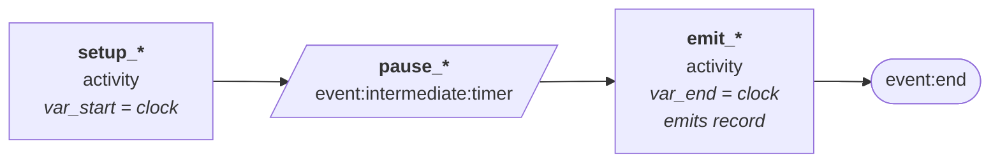

# clock

`clock` returns the current simulated clock time. What happens to that value depends on where it appears:

- **In an emitter `dimensions` block** — returns the current clock time, which goes into the output record as the named field. This is the most common use: a timestamp on every emitted record.
- **In an activity `variables` block** — returns the current clock time, which is stored in the variable namespace under the given name. Use this to snapshot the clock *before* a timer advances, so you can reference both a start and an end time in the same record.

| Field | Required? | Description |
| --- | --- | --- |
| `type` | Yes | `clock` |
| `name` | Yes | The namespace key (in `variables`) or the output field name (in `dimensions`). |

`clock` does not support `percent_missing` or `percent_nulls` — it is always present.

## In emitter dimensions (timestamp on every record)

```json
{"name": "time", "type": "generator:clock"}
```

The current clock time is written into every record as `time`. The clock reflects wherever in the state machine the worker currently is.

## In activity variables (snapshot for start/end patterns)

```json
{"name": "var_start", "type": "generator:clock"}
```

The current clock time is stored in the namespace as `var_start`. A later activity can then capture `var_end` the same way, and both are referenced from the emitter via `"type": "variable"` — producing a record with both a start and an end timestamp.


