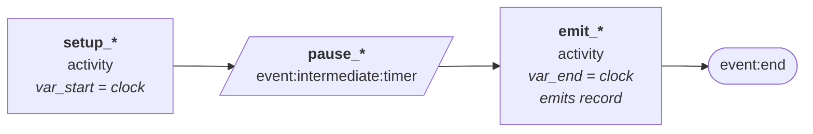

# Clock timestamp

`generator:clock` returns the current simulated clock time. The value advances
with the Actor's position in the state machine: each timer state moves the clock
forward. What happens to the value depends on where it appears:

- **In an emitter `dimensions` list**, the time goes into the output record as
  the named field. This is the most common use: a timestamp on every record.
- **In an activity `variables` block**, the time is stored in the worker's
  variables under the given name. Use this to capture the time _before_ a timer
  advances the clock, so a later record can include both a start and an end
  time.

| Field  | Required? | Description                                                                    |
| ------ | --------- | ------------------------------------------------------------------------------ |
| `type` | Yes       | `generator:clock`                                                              |
| `name` | Yes       | The output field name (in `dimensions`) or the variable name (in `variables`). |

Unlike other generators, `generator:clock` does not support `percent_missing` or
`percent_nulls`. It is always present.

## Timestamp on every record

```json
{"name": "time", "type": "generator:clock"}
```

## Start and end times

```json
{"name": "var_start", "type": "generator:clock"}
```

An activity stores the current time as `var_start`. After a timer, a later
activity captures `var_end` the same way. The emitter then reads both with
[`"type": "variable"`](../variable.md), producing a record with a start and an
end time.


```mermaid
flowchart LR
    A["<b>setup_*</b><br/>activity<br/><i>var_start = clock</i>"] --> B
    B[/"<b>pause_*</b><br/>event:intermediate:timer"/] --> C
    C["<b>emit_*</b><br/>activity<br/><i>var_end = clock</i><br/><i>emits record</i>"] --> D(["event:end"])
```
