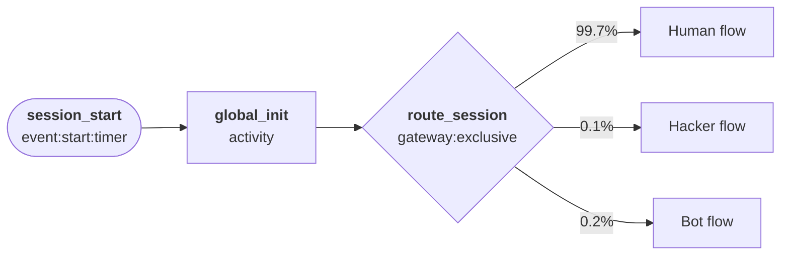
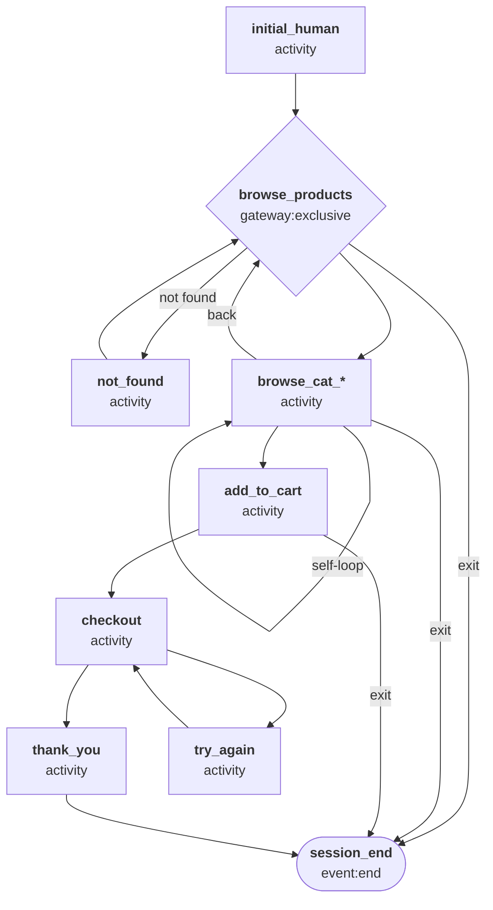
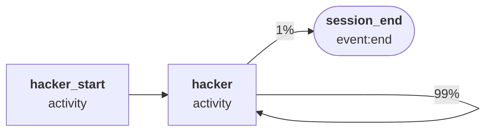
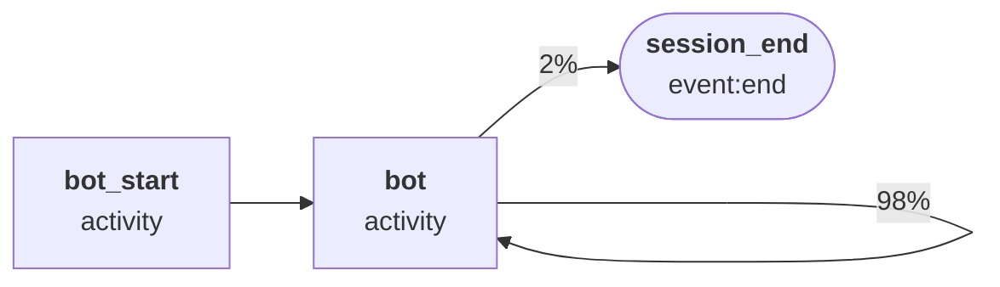

# Ecommerce — Generic Store

A mid-traffic e-commerce scenario simulating a general retail store. Sits between the lighting (busier) and furniture (quieter) variants in terms of traffic volume and session duration.

## Quick start

```bash
# Apache combined log
python generator.py -c presets/configs/ecommerce.json --template access_combined -n 100 -s "2025-01-01T00:00"

# JSON (Splunk TA)
python generator.py -c presets/configs/ecommerce.json --template apache:access:json -r PT1H -s "2025-01-01T00:00"

# CSV
python generator.py -c presets/configs/ecommerce.json --template csv -n 1000 -s "2025-01-01T00:00"

# With time-of-day variation (schedule modulates the -m cap)
python generator.py -c presets/configs/ecommerce.json --template access_combined \
  -m 300 -s "2025-01-01T00:00" --schedule presets/schedules/ecommerce.json
```

## Templates

| Template | Output |
| --- | --- |
| `apache:access:json` | Splunk TA JSON (`KV_MODE=json`) |
| `apache:access:kv` | Splunk TA key=value pairs |
| `apache:access:combined` | NCSA combined log (Splunk `apache:access:combined` sourcetype) |
| `access_combined` | NCSA combined log (Splunk `access_combined` pre-trained sourcetype) |
| `access_combined_wcookie` | NCSA combined log with cookie field appended |
| `access_common` | NCSA common log (no referrer or user-agent) |
| `csv` | CSV with header row |

## Output fields

| Field | Description |
| --- | --- |
| `time` | Request timestamp |
| `client` | Client IP address |
| `ident` | RFC 1413 identity (always `-`) |
| `user` | Authenticated username (usually `-`) |
| `http_method` | HTTP method (`GET`, `POST`, etc.) |
| `uri_path` | Request path |
| `uri_query` | Query string (empty if none) |
| `http_version` | Protocol version (`HTTP/1.0`, `HTTP/1.1`, `HTTP/2`) |
| `status` | HTTP response status code |
| `bytes_out` | Response bytes |
| `bytes_in` | Request bytes |
| `http_referrer` | Referrer URL |
| `http_user_agent` | User-Agent string |
| `http_content_type` | Content-Type of the response |
| `cookie` | Session cookie value |
| `server` | Server IP address |
| `dest_port` | Server port (80 or 443) |
| `response_time_microseconds` | Response latency in microseconds |

## Product categories

| Category | Weight | Example products |
| --- | --- | --- |
| Electronics | 25% | Laptop, wireless headphones, smartwatch, tablet, portable speaker |
| Clothing | 22% | Casual jacket, running shoes, denim jeans, summer dress, wool sweater |
| Home & Garden | 18% | Coffee maker, scented candles, throw pillow, indoor plant pot, wall art |
| Kitchen | 15% | Non-stick pan, chef's knife, French press, cutting board, blender |
| Sports | 12% | Yoga mat, resistance bands, water bottle, gym bag, foam roller |
| Beauty | 8% | Face moisturiser, vitamin C serum, lip balm, essential oil, hair mask |

## Session routing

Each session is routed at startup by `global_init` (no event emitted):

| Session type | Probability | Description |
| --- | --- | --- |
| Human | 99.7% | Normal shopper browsing the store |
| Hacker | 0.1% | Automated scanner probing for vulnerabilities |
| Bot | 0.2% | Web crawler indexing site content |



---

## Human flow



`initial_human` emits the homepage (`/`) hit and sets session-level properties — IP address, browser user-agent, cookie, and HTTP version — which persist unchanged for the rest of the session.

From `browse_products` the worker selects a product category (`browse_cat_electronics`, `browse_cat_clothing`, `browse_cat_home_garden`, `browse_cat_kitchen`, `browse_cat_sports`, `browse_cat_beauty`). Each category state can self-loop, proceed to `add_to_cart`, return to `browse_products`, or exit. `not_found` generates a 404 and loops back to `browse_products`.

---

## Hacker flow



`hacker_start` fires once on session entry (no event emitted) to pin the session-level properties:

| Property | Value |
| --- | --- |
| User-agent | One of: `sqlmap/1.7.8`, `Nikto/2.1.6`, `masscan/1.3`, `zgrab/0.x`, `curl/7.68.0`, `python-requests/2.28.1`, `Go-http-client/1.1`, `Wget/1.21.2` |
| Client IP | Drawn from a pool of **3 IPs** (simulates a single attacker or small botnet) |
| HTTP version | Always `HTTP/1.1` |

The `hacker` state then loops at ~0.01 s interarrival, emitting probe requests with:

- **Paths:** `/.env`, `/.git/config`, `/phpinfo.php`, `/admin/*`, `/wp-admin`, path traversal strings, backup files
- **Query strings:** SQL injection fragments (`?user=admin'--`, `?query=SELECT%20*%20FROM%20users`), `?cmd=whoami`
- **Methods:** GET, POST, PUT, DELETE
- **Status codes:** 400, 401, 403, 404, 500, 502, 503

The loop continues with 99% probability, averaging ~100 probe requests per session before stopping.

---

## Bot flow



`bot_start` fires once on session entry (no event emitted) to pin the session-level properties:

| Property | Value |
| --- | --- |
| User-agent | One of: `Googlebot/2.1`, `bingbot/2.0`, `Applebot/0.1`, `SemrushBot/7`, `AhrefsBot/7.0`, `DotBot/1.2`, `python-requests/2.28.1`, `curl/7.68.0`, `Scrapy/2.11.0` |
| Client IP | Drawn from a pool of **5 IPs** (simulates a crawler's datacenter egress range) |
| HTTP version | Always `HTTP/1.1` |

The `bot` state then loops at ~1 s interarrival, emitting crawl requests with:

- **Paths:** `/robots.txt`, `/sitemap.xml`, `/products`, category index pages, individual product pages
- **Methods:** GET only
- **Status codes:** ~67% 200, ~22% 301, ~11% 404
- **Referrer:** always `-`

The loop continues with 98% probability, averaging ~50 crawl requests per session before stopping.

---

## Concurrency (`-m`)

| Little's Law component | Value |
| --- | --- |
| Average session duration (W) | ~1,800 seconds (~30 minutes) |
| Interarrival mean | 1.0 s |
| Base arrival rate (λ = 1/mean) | ~1.0 sessions/sec |
| Maximum useful `-m` (L = λW) | ~1,800 |

Setting `-m` above ~1,800 has no effect in either mode — sessions complete faster than new ones arrive, so the natural concurrency never fills the pool.
