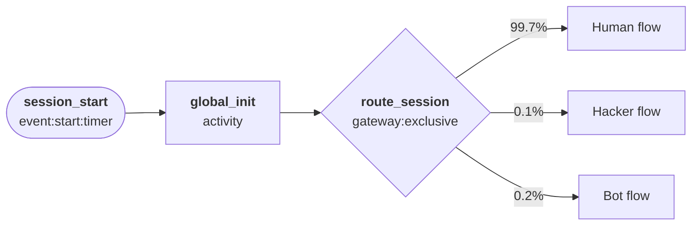
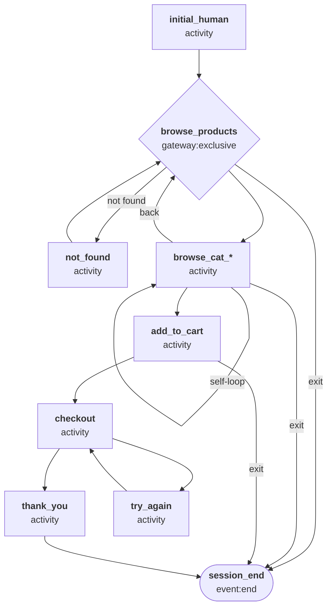
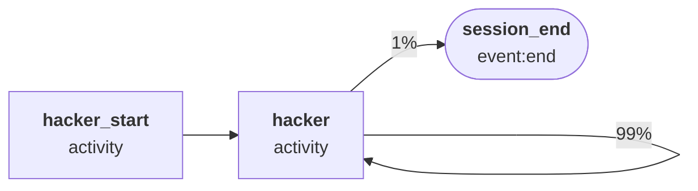
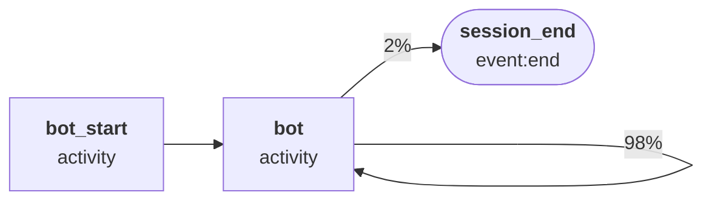
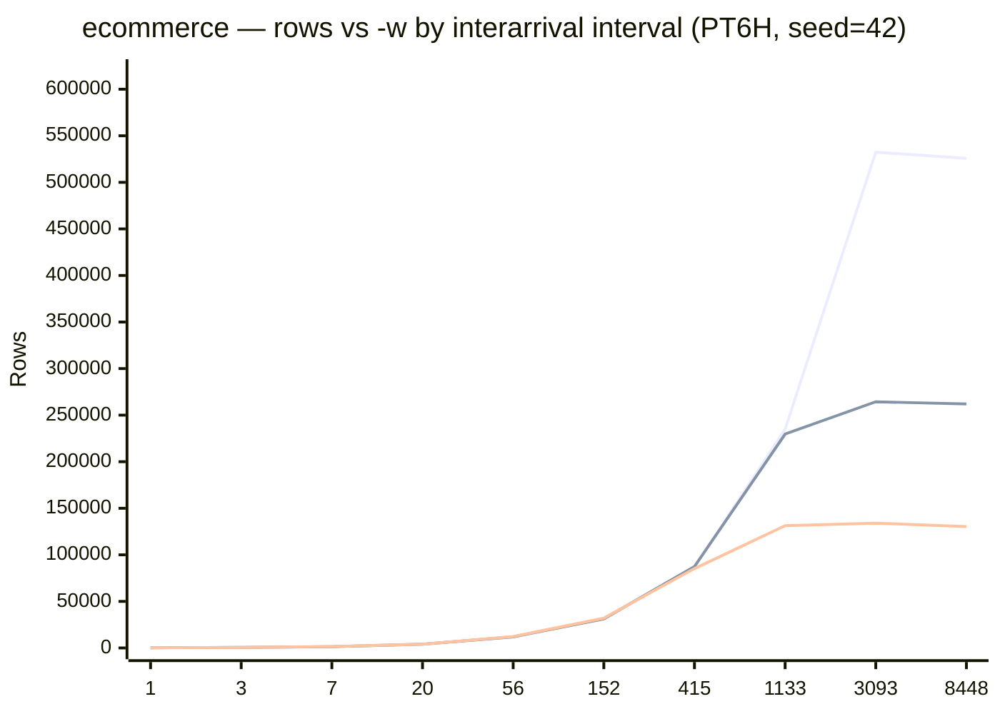

# Ecommerce — Generic Store

A mid-traffic e-commerce scenario simulating a general retail store. Sits between the lighting (busier) and furniture (quieter) variants in terms of traffic volume and session duration.

## Quick start

```bash
# Apache combined log
python generator.py -c presets/configs/ecommerce.json --template access_combined -n 100 -s "2025-01-01T00:00"

# JSON (Splunk TA)
python generator.py -c presets/configs/ecommerce.json --template apache:access:json -r PT1H -s "2025-01-01T00:00"

# CSV
python generator.py -c presets/configs/ecommerce.json --template csv -n 1000 -s "2025-01-01T00:00"

# With time-of-day variation (schedule modulates the -w cap)
python generator.py -c presets/configs/ecommerce.json --template access_combined \
  -w 300 -s "2025-01-01T00:00" --schedule presets/schedules/ecommerce.json

# IIS W3C log (Splunk ms:iis:auto sourcetype — recommended)
python generator.py -c presets/configs/ecommerce.json --template ms:iis:auto -r PT1H -s "2025-01-01T00:00"

# OCSF HTTP Activity (security data lake / SIEM ingestion)
python generator.py -c presets/configs/ecommerce.json --template ocsf:http_activity -r PT1H -s "2025-01-01T00:00"
```

## Templates

| Template | Output |
| --- | --- |
| `apache:access:json` | Splunk TA JSON (`KV_MODE=json`) |
| `apache:access:kv` | Splunk TA key=value pairs |
| `apache:access:combined` | NCSA combined log (Splunk `apache:access:combined` sourcetype) |
| `access_combined` | NCSA combined log (Splunk `access_combined` pre-trained sourcetype) |
| `access_combined_wcookie` | NCSA combined log with cookie field appended |
| `access_common` | NCSA common log (no referrer or user-agent) |
| `csv` | CSV with header row |
| `ms:iis:auto` | IIS W3C log (`ms:iis:auto` sourcetype) |
| `ms:iis:default:85` | IIS W3C log (`ms:iis:default:85` sourcetype — identical output to `ms:iis:auto`, included for completeness) |
| `ms:iis:default` | IIS W3C log (`ms:iis:default` sourcetype, IIS 7.0 field ordering) |
| `ms:iis:splunk` | IIS W3C log (`ms:iis:splunk` sourcetype, adds `Content-Type` and `https` fields) |
| `ocsf:http_activity` | [OCSF](https://schema.ocsf.io/) 1.4.0 HTTP Activity (`class_uid` 4002) JSON — one event per request, for security data lake / SIEM ingestion |

When generating IIS data for Splunk, use `--template ms:iis:auto` — the other IIS templates are included for completeness but have been marked as deprecated by Splunk.

The `ocsf:http_activity` template maps every session's requests — human, bot, and the `Hacker` actor's probe traffic — onto the OCSF Network Activity category. `activity_id`/`type_uid` are derived from `http_method`; `severity_id`/`status_id` are derived from `status` (2xx/3xx → informational/success, 4xx → medium/failure, 5xx → high/failure). Verified against the real OCSF 1.4.0 `http_activity` JSON Schema (via the [`ocsf-json-schema`](https://github.com/nsmithuk/ocsf-json-schema) package) across all three actor types.

## Output fields

| Field | Description |
| --- | --- |
| `time` | Request timestamp |
| `client` | Client IP address |
| `ident` | RFC 1413 identity (always `-`) |
| `user` | Authenticated username (usually `-`) |
| `http_method` | HTTP method (`GET`, `POST`, etc.) |
| `uri_path` | Request path |
| `uri_query` | Query string (empty if none) |
| `http_version` | Protocol version (`HTTP/1.0`, `HTTP/1.1`, `HTTP/2`) |
| `status` | HTTP response status code |
| `bytes_out` | Response bytes |
| `bytes_in` | Request bytes |
| `http_referrer` | Referrer URL |
| `http_user_agent` | User-Agent string |
| `http_content_type` | Content-Type of the response |
| `cookie` | Session cookie value |
| `server` | Server IP address |
| `dest_port` | Server port (80 or 443) |
| `response_time_microseconds` | Response latency in microseconds |

## Product categories

| Category | Weight | Example products |
| --- | --- | --- |
| Electronics | 25% | Laptop, wireless headphones, smartwatch, tablet, portable speaker |
| Clothing | 22% | Casual jacket, running shoes, denim jeans, summer dress, wool sweater |
| Home & Garden | 18% | Coffee maker, scented candles, throw pillow, indoor plant pot, wall art |
| Kitchen | 15% | Non-stick pan, chef's knife, French press, cutting board, blender |
| Sports | 12% | Yoga mat, resistance bands, water bottle, gym bag, foam roller |
| Beauty | 8% | Face moisturiser, vitamin C serum, lip balm, essential oil, hair mask |

## Session routing

Each session is routed at startup by `global_init` (no event emitted):

| Session type | Probability | Description |
| --- | --- | --- |
| Human | 99.7% | Normal shopper browsing the store |
| Hacker | 0.1% | Automated scanner probing for vulnerabilities |
| Bot | 0.2% | Web crawler indexing site content |


```mermaid
flowchart LR
    A(["<b>session_start</b><br/>event:start:timer"]) --> B["<b>global_init</b><br/>activity"]
    B --> C{"<b>route_session</b><br/>gateway:exclusive"}
    C -->|"99.7%"| D["Human flow"]
    C -->|"0.1%"| E["Hacker flow"]
    C -->|"0.2%"| F["Bot flow"]
```

---

## Human flow


```mermaid
flowchart TD
    A["<b>initial_human</b><br/>activity"] --> B{"<b>browse_products</b><br/>gateway:exclusive"}
    B -->|"exit"| Z(["<b>session_end</b><br/>event:end"])
    B -->|"not found"| D["<b>not_found</b><br/>activity"]
    B --> C["<b>browse_cat_*</b><br/>activity"]
    D --> B
    C -->|"self-loop"| C
    C -->|"back"| B
    C -->|"exit"| Z
    C --> E["<b>add_to_cart</b><br/>activity"]
    E -->|"exit"| Z
    E --> F["<b>checkout</b><br/>activity"]
    F --> G["<b>thank_you</b><br/>activity"]
    G --> Z
    F --> H["<b>try_again</b><br/>activity"]
    H --> F
```

`initial_human` emits the homepage (`/`) hit and sets session-level properties — IP address, browser user-agent, cookie, and HTTP version — which persist unchanged for the rest of the session.

From `browse_products` the worker selects a product category (`browse_cat_electronics`, `browse_cat_clothing`, `browse_cat_home_garden`, `browse_cat_kitchen`, `browse_cat_sports`, `browse_cat_beauty`). Each category state can self-loop, proceed to `add_to_cart`, return to `browse_products`, or exit. `not_found` generates a 404 and loops back to `browse_products`.

---

## Hacker flow


```mermaid
flowchart LR
    A["<b>hacker_start</b><br/>activity"] --> B["<b>hacker</b><br/>activity"]
    B -->|"99%"| B
    B -->|"1%"| Z(["<b>session_end</b><br/>event:end"])
```

`hacker_start` fires once on session entry (no event emitted) to pin the session-level properties:

| Property | Value |
| --- | --- |
| User-agent | One of: `sqlmap/1.7.8`, `Nikto/2.1.6`, `masscan/1.3`, `zgrab/0.x`, `curl/7.68.0`, `python-requests/2.28.1`, `Go-http-client/1.1`, `Wget/1.21.2` |
| Client IP | Drawn from a pool of **3 IPs** (simulates a single attacker or small botnet) |
| HTTP version | Always `HTTP/1.1` |

The `hacker` state then loops at ~0.01 s interarrival, emitting probe requests with:

- **Paths:** `/.env`, `/.git/config`, `/phpinfo.php`, `/admin/*`, `/wp-admin`, path traversal strings, backup files
- **Query strings:** SQL injection fragments (`?user=admin'--`, `?query=SELECT%20*%20FROM%20users`), `?cmd=whoami`
- **Methods:** GET, POST, PUT, DELETE
- **Status codes:** 400, 401, 403, 404, 500, 502, 503

The loop continues with 99% probability, averaging ~100 probe requests per session before stopping.

---

## Bot flow


```mermaid
flowchart LR
    A["<b>bot_start</b><br/>activity"] --> B["<b>bot</b><br/>activity"]
    B -->|"98%"| B
    B -->|"2%"| Z(["<b>session_end</b><br/>event:end"])
```

`bot_start` fires once on session entry (no event emitted) to pin the session-level properties:

| Property | Value |
| --- | --- |
| User-agent | One of: `Googlebot/2.1`, `bingbot/2.0`, `Applebot/0.1`, `SemrushBot/7`, `AhrefsBot/7.0`, `DotBot/1.2`, `python-requests/2.28.1`, `curl/7.68.0`, `Scrapy/2.11.0` |
| Client IP | Drawn from a pool of **5 IPs** (simulates a crawler's datacenter egress range) |
| HTTP version | Always `HTTP/1.1` |

The `bot` state then loops at ~1 s interarrival, emitting crawl requests with:

- **Paths:** `/robots.txt`, `/sitemap.xml`, `/products`, category index pages, individual product pages
- **Methods:** GET only
- **Status codes:** ~67% 200, ~22% 301, ~11% 404
- **Referrer:** always `-`

The loop continues with 98% probability, averaging ~50 crawl requests per session before stopping.

---

## Volume

The `-w` ceiling at the preset's default interarrival interval is ~2,112. Setting `-w` above this has no effect — the worker pool is never fully used. To model heavier traffic, lower the interarrival interval instead (via `-i`, or by editing the config's `event:start:timer` directly).

Halving the interval (2x arrival rate) raises the ceiling to ~4,224; doubling it (0.5x arrival rate) lowers it to ~1,056. The ceiling scales linearly with arrival rate.

The table below shows how output scales with `-w` at each interval (`--seed 42`, no schedule, PT6H simulated window). To regenerate: `python tools/bench_config.py -c presets/configs/ecommerce.json --compare-start-interval`.

| `-w` | Rows — 1/2x interval | Rows — default | Rows — 2x interval |
| ---: | ---: | ---: | ---: |
| 1 | 197 | 198 | 198 |
| 3 | 601 | 628 | 641 |
| 7 | 1,458 | 1,392 | 1,565 |
| 20 | 4,285 | 4,056 | 4,072 |
| 56 | 11,708 | 11,923 | 12,312 |
| 152 | 31,825 | 31,217 | 32,013 |
| 415 | 86,819 | 87,414 | 85,211 |
| 1,133 | 234,991 | 229,624 | 131,340 |
| 3,093 | 532,345 | 264,361 | 134,027 |
| 8,448 | 525,774 | 262,022 | 130,399 |


```mermaid
xychart-beta
    title "ecommerce — rows vs -w by interarrival interval (PT6H, seed=42)"
    x-axis [1, 3, 7, 20, 56, 152, 415, 1133, 3093, 8448]
    y-axis "Rows" 0 --> 620000
    line [197, 601, 1458, 4285, 11708, 31825, 86819, 234991, 532345, 525774]
    line [198, 628, 1392, 4056, 11923, 31217, 87414, 229624, 264361, 262022]
    line [198, 641, 1565, 4072, 12312, 32013, 85211, 131340, 134027, 130399]
```
