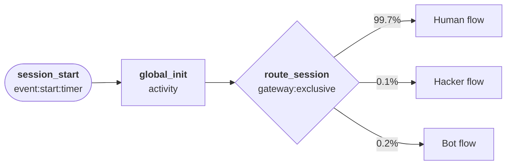
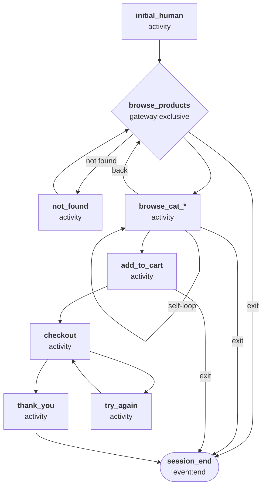
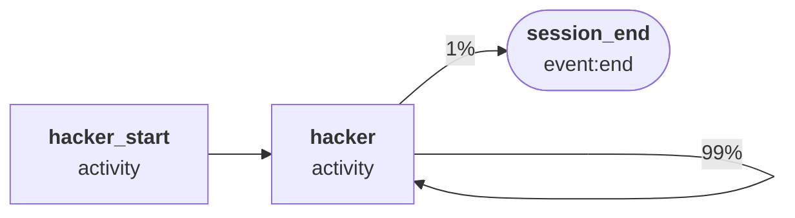
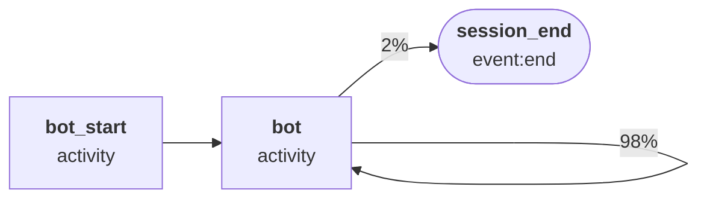
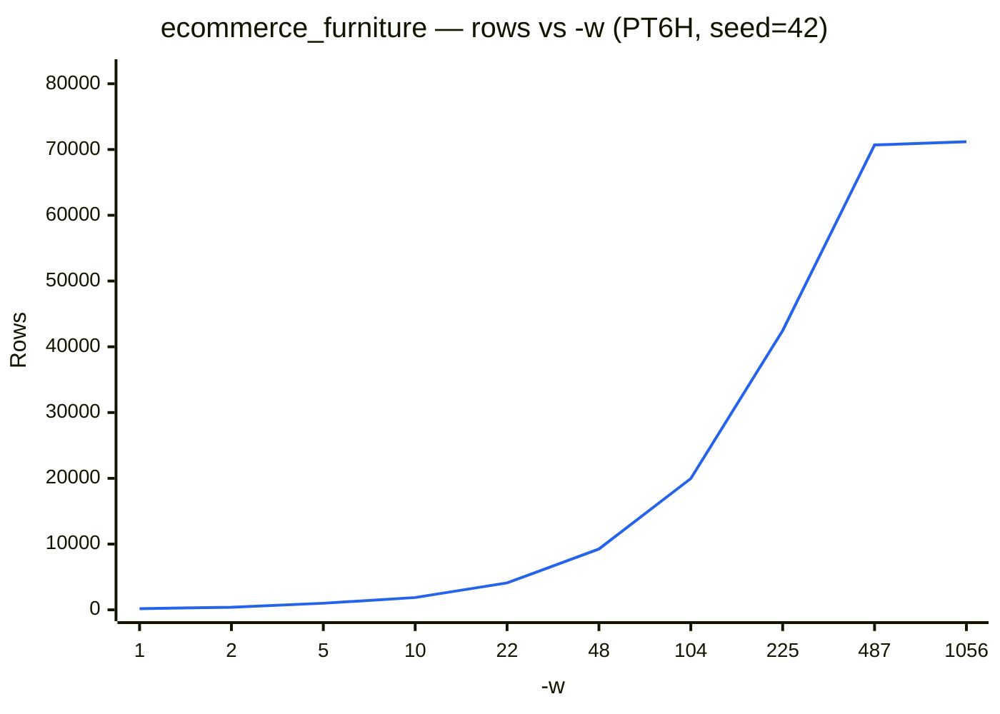

# Ecommerce — Furniture Store

A lower-traffic e-commerce scenario simulating a furniture retailer. Quieter
than the generic ecommerce config, with longer average session durations
reflecting considered, high-value purchases.

## Quick start

```bash
# Apache combined log
python generator.py -c presets/configs/ecommerce_furniture.json --template \
  access_combined -n 100 -s "2025-01-01T00:00"

# JSON (Splunk TA)
python generator.py -c presets/configs/ecommerce_furniture.json --template \
  apache:access:json -r PT1H -s "2025-01-01T00:00"

# CSV
python generator.py -c presets/configs/ecommerce_furniture.json --template csv \
  -n 1000 -s "2025-01-01T00:00"

# With time-of-day variation
python generator.py -c presets/configs/ecommerce_furniture.json --template \
  access_combined -w 200 --schedule presets/schedules/ecommerce.json

# IIS W3C log (Splunk ms:iis:auto sourcetype — recommended)
python generator.py -c presets/configs/ecommerce_furniture.json --template \
  ms:iis:auto -r PT1H -s "2025-01-01T00:00"

# OCSF HTTP Activity (security data lake / SIEM ingestion)
python generator.py -c presets/configs/ecommerce_furniture.json --template \
  ocsf:http_activity -r PT1H -s "2025-01-01T00:00"
```

## Templates

| Template | Output |
| --- | --- |
| `apache:access:json` | Splunk TA JSON (`KV_MODE=json`) |
| `apache:access:kv` | Splunk TA key=value pairs |
| `apache:access:combined` | NCSA combined log (Splunk `apache:access:combined` sourcetype) |
| `access_combined` | NCSA combined log (Splunk `access_combined` pre-trained sourcetype) |
| `access_combined_wcookie` | NCSA combined log with cookie field appended |
| `access_common` | NCSA common log (no referrer or user-agent) |
| `csv` | CSV with header row |
| `ms:iis:auto` | IIS W3C log (`ms:iis:auto` sourcetype) |
| `ms:iis:default:85` | IIS W3C log (`ms:iis:default:85` sourcetype — identical output to `ms:iis:auto`, included for completeness) |
| `ms:iis:default` | IIS W3C log (`ms:iis:default` sourcetype, IIS 7.0 field ordering) |
| `ms:iis:splunk` | IIS W3C log (`ms:iis:splunk` sourcetype, adds `Content-Type` and `https` fields) |
| `ocsf:http_activity` | [OCSF](https://schema.ocsf.io/) 1.4.0 HTTP Activity (`class_uid` 4002) JSON — one event per request, for security data lake / SIEM ingestion |

When generating IIS data for Splunk, use `--template ms:iis:auto` — the other
IIS templates are included for completeness but have been marked as deprecated
by Splunk.

The `ocsf:http_activity` template maps every session's requests — human, bot,
and the `Hacker` actor's probe traffic — onto the OCSF Network Activity
category. `activity_id`/`type_uid` are derived from `http_method`;
`severity_id`/`status_id` are derived from `status` (2xx/3xx →
informational/success, 4xx → medium/failure, 5xx → high/failure). Verified
against the real OCSF 1.4.0 `http_activity` JSON Schema (via the
[`ocsf-json-schema`](https://github.com/nsmithuk/ocsf-json-schema) package)
across all three actor types.

## Output fields

| Field | Description |
| --- | --- |
| `time` | Request timestamp |
| `client` | Client IP address |
| `ident` | RFC 1413 identity (always `-`) |
| `user` | Authenticated username (usually `-`) |
| `http_method` | HTTP method (`GET`, `POST`, etc.) |
| `uri_path` | Request path |
| `uri_query` | Query string (empty if none) |
| `http_version` | Protocol version (`HTTP/1.1`, `HTTP/2.0`) |
| `status` | HTTP response status code |
| `bytes_out` | Response bytes |
| `bytes_in` | Request bytes |
| `http_referrer` | Referrer URL |
| `http_user_agent` | User-Agent string |
| `http_content_type` | Content-Type of the response |
| `cookie` | Session cookie value |
| `server` | Server IP address |
| `dest_port` | Server port (80 or 443) |
| `response_time_microseconds` | Response latency in microseconds |

## Product categories

| Category | Weight | Example products |
| --- | --- | --- |
| Living room | 35% | Sectional sofa, leather armchair, coffee table, TV stand, bookcase |
| Bedroom | 25% | Platform bed, nightstand, dresser, wardrobe, vanity desk |
| Dining room | 15% | Dining table, dining chair, sideboard, bar stool, china cabinet |
| Office | 13% | Standing desk, task chair, filing cabinet, writing desk, bookshelf |
| Outdoor | 10% | Patio dining set, lounge chair, garden bench, hammock, Adirondack chair |

## Session routing

Each session is routed at startup by `global_init` (no event emitted):

| Session type | Probability | Description |
| --- | --- | --- |
| Human | 99.7% | Normal shopper browsing the store |
| Hacker | 0.1% | Automated scanner probing for vulnerabilities |
| Bot | 0.2% | Web crawler indexing site content |



---

## Human flow



`initial_human` emits the homepage (`/`) hit and sets session-level properties —
IP address, browser user-agent, cookie, and HTTP version — which persist
unchanged for the rest of the session.

From `browse_products` the worker selects a product category
(`browse_cat_living_room`, `browse_cat_bedroom`, `browse_cat_dining_room`,
`browse_cat_office`, `browse_cat_outdoor`). Each category state can self-loop
(dwell time: 90–300 s, reflecting considered high-value purchases), proceed to
`add_to_cart`, return to `browse_products`, or exit. `not_found` generates a 404
and loops back to `browse_products`. `add_to_cart` has a 15% stop probability
(higher than lighting, reflecting more committed buyers who abandon at the cart
stage).

---

## Hacker flow



`hacker_start` fires once on session entry (no event emitted) to pin the
session-level properties:

| Property | Value |
| --- | --- |
| User-agent | One of: `sqlmap/1.7.8`, `Nikto/2.1.6`, `masscan/1.3`, `zgrab/0.x`, `curl/7.68.0`, `python-requests/2.28.1`, `Go-http-client/1.1`, `Wget/1.21.2` |
| Client IP | Drawn from a pool of **3 IPs** (simulates a single attacker or small botnet) |
| HTTP version | Always `HTTP/1.1` |

The `hacker` state then loops at ~0.01 s interarrival, emitting probe requests
with:

- **Paths:** `/.env`, `/.git/config`, `/phpinfo.php`, `/admin/*`, `/wp-admin`,
  path traversal strings, backup files
- **Query strings:** SQL injection fragments (`?user=admin'--`,
  `?query=SELECT%20*%20FROM%20users`), `?cmd=whoami`
- **Methods:** GET, POST, PUT, DELETE
- **Status codes:** 400, 401, 403, 404, 500, 502, 503

The loop continues with 99% probability, averaging ~100 probe requests per
session before stopping.

---

## Bot flow



`bot_start` fires once on session entry (no event emitted) to pin the
session-level properties:

| Property | Value |
| --- | --- |
| User-agent | One of: `Googlebot/2.1`, `bingbot/2.0`, `Applebot/0.1`, `SemrushBot/7`, `AhrefsBot/7.0`, `DotBot/1.2`, `python-requests/2.28.1`, `curl/7.68.0`, `Scrapy/2.11.0` |
| Client IP | Drawn from a pool of **5 IPs** (simulates a crawler's datacenter egress range) |
| HTTP version | Always `HTTP/1.1` |

The `bot` state then loops at ~1 s interarrival, emitting crawl requests with:

- **Paths:** `/robots.txt`, `/sitemap.xml`, `/products`, category index pages,
  individual product pages
- **Methods:** GET only
- **Status codes:** ~67% 200, ~22% 301, ~11% 404
- **Referrer:** always `-`

The loop continues with 98% probability, averaging ~50 crawl requests per
session before stopping.

---

## Volume

The default start interval for workers in this preset is 3 seconds, with each
worker busy for 1584 seconds on average. The maximum number of workers that can
be busy at the same time is therefore 1584/3 = 528; increasing available workers
(using `-w`) without adjusting how often they begin work (using `-i`) has no
effect.

The chart below shows how output scales with workers (varying `-w`) with the
preset's default start interval (`--seed 42`, no schedule, PT6H simulated
window). To regenerate: `python tools/bench_config_workers.py -c
presets/configs/ecommerce_furniture.json`.



Adjust `-i` and `-w` to model heavier traffic. The table below illustrates how
output scales across `-w` and `-i` together (`--seed 42`, no schedule, PT6H
simulated window). To regenerate: `python tools/bench_grid.py -c
presets/configs/ecommerce_furniture.json`.

| `-i` \ `-w` | 1 | 5 | 25 | 100 | 250 | 1,000 | 2,500 | 5,000 |
| :--- | :--- | :--- | :--- | :--- | :--- | :--- | :--- | :--- |
| 0.01 | ↕️ | ↕️ | ↕️ | ↕️ | ↕️ | 🟥 192,335 (9.9s) | 🟥 480,122 (19.9s) | 🟥 962,092 (37.4s) |
| 0.1 | 🟩 176 (0.5s) | 🟩 942 (0.5s) | 🟨 4,831 (0.7s) | 🟧 19,755 (1.1s) | 🟧 48,314 (2.0s) | 🟥 191,563 (6.6s) | 🟥 480,627 (16.4s) | 🟥 948,690 (32.9s) |
| 1 | 🟩 178 (0.2s) | 🟩 993 (0.3s) | 🟨 4,917 (0.4s) | 🟧 18,733 (0.8s) | 🟧 47,621 (1.7s) | 🟥 185,879 (6.0s) | 🟥 215,094 (7.0s) | ↔️ |
| 3 (default) | 🟩 184 (0.2s) | 🟩 928 (0.3s) | 🟨 4,873 (0.4s) | 🟧 18,798 (0.8s) | 🟧 47,311 (1.7s) | 🟧 70,810 (2.4s) | ↔️ | ↔️ |

💥 = Crashed. ⏱️ = Timeout. ↔️ = Plateau -- increasing -w had
no effect. ↕️ = Plateau -- decreasing -i had no effect. (Ns) = wall-clock
seconds for that cell's own run -- not shown for skipped/plateau cells, which
were never actually run.
