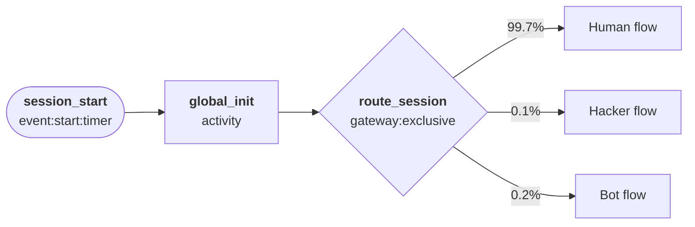
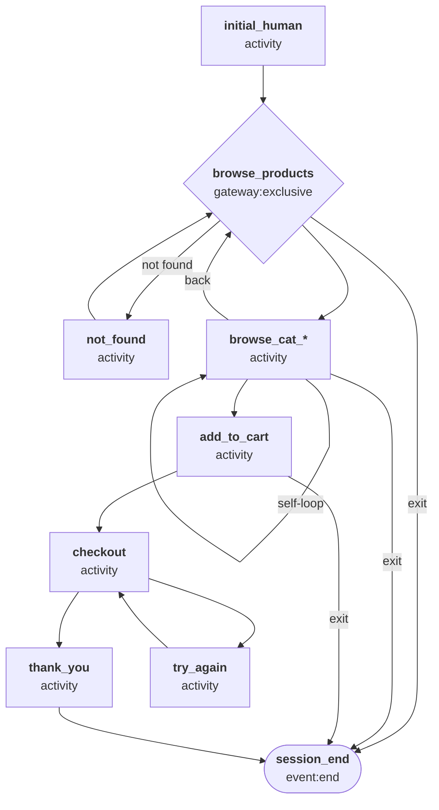
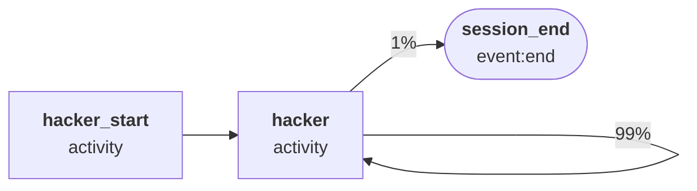
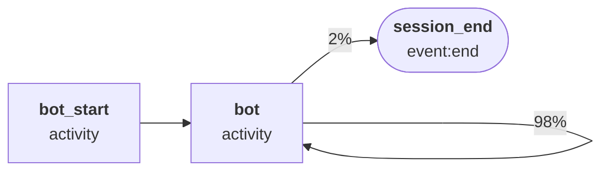
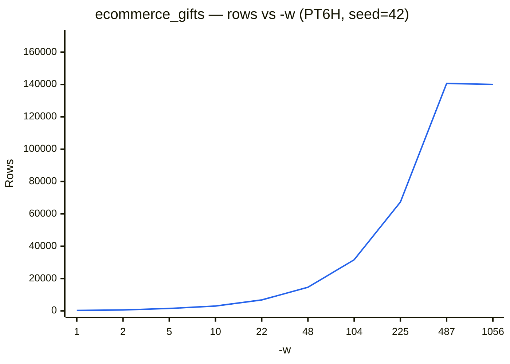

# Ecommerce — Gifts Store

A medium-traffic e-commerce scenario simulating a gift retailer. Busier than the furniture store, with shorter dwell times reflecting impulse and occasion-driven purchases. Referrer traffic skews toward social media (Pinterest, Instagram, TikTok) and lifestyle publications rather than home improvement or trade sites.

## Quick start

```bash
# Apache combined log
python generator.py -c presets/configs/ecommerce_gifts.json --template access_combined -n 100 -s "2025-01-01T00:00"

# JSON (Splunk TA)
python generator.py -c presets/configs/ecommerce_gifts.json --template apache:access:json -r PT1H -s "2025-01-01T00:00"

# CSV
python generator.py -c presets/configs/ecommerce_gifts.json --template csv -n 1000 -s "2025-01-01T00:00"

# With time-of-day variation
python generator.py -c presets/configs/ecommerce_gifts.json --template access_combined \
  -m 400 --schedule presets/schedules/ecommerce.json

# IIS W3C log (Splunk ms:iis:auto sourcetype — recommended)
python generator.py -c presets/configs/ecommerce_gifts.json --template ms:iis:auto -r PT1H -s "2025-01-01T00:00"
```

## Templates

| Template | Output |
| --- | --- |
| `apache:access:json` | Splunk TA JSON (`KV_MODE=json`) |
| `apache:access:kv` | Splunk TA key=value pairs |
| `apache:access:combined` | NCSA combined log (Splunk `apache:access:combined` sourcetype) |
| `access_combined` | NCSA combined log (Splunk `access_combined` pre-trained sourcetype) |
| `access_combined_wcookie` | NCSA combined log with cookie field appended |
| `access_common` | NCSA common log (no referrer or user-agent) |
| `csv` | CSV with header row |
| `ms:iis:auto` | IIS W3C log (`ms:iis:auto` sourcetype) |
| `ms:iis:default:85` | IIS W3C log (`ms:iis:default:85` sourcetype — identical output to `ms:iis:auto`, included for completeness) |
| `ms:iis:default` | IIS W3C log (`ms:iis:default` sourcetype, IIS 7.0 field ordering) |
| `ms:iis:splunk` | IIS W3C log (`ms:iis:splunk` sourcetype, adds `Content-Type` and `https` fields) |
| `ocsf:http_activity` | [OCSF](https://schema.ocsf.io/) 1.4.0 HTTP Activity (`class_uid` 4002) JSON — one event per request, for security data lake / SIEM ingestion |

When generating IIS data for Splunk, use `--template ms:iis:auto` — the other IIS templates are included for completeness but have been marked as deprecated by Splunk.

The `ocsf:http_activity` template maps every session's requests — human, bot, and the `Hacker` actor's probe traffic — onto the OCSF Network Activity category. `activity_id`/`type_uid` are derived from `http_method`; `severity_id`/`status_id` are derived from `status` (2xx/3xx → informational/success, 4xx → medium/failure, 5xx → high/failure). Verified against the real OCSF 1.4.0 `http_activity` JSON Schema (via the [`ocsf-json-schema`](https://github.com/nsmithuk/ocsf-json-schema) package) across all three actor types.

## Output fields

| Field | Description |
| --- | --- |
| `time` | Request timestamp |
| `client` | Client IP address |
| `ident` | RFC 1413 identity (always `-`) |
| `user` | Authenticated username (usually `-`) |
| `http_method` | HTTP method (`GET`, `POST`, etc.) |
| `uri_path` | Request path |
| `uri_query` | Query string (empty if none) |
| `http_version` | Protocol version (`HTTP/1.1`, `HTTP/2.0`) |
| `status` | HTTP response status code |
| `bytes_out` | Response bytes |
| `bytes_in` | Request bytes |
| `http_referrer` | Referrer URL |
| `http_user_agent` | User-Agent string |
| `http_content_type` | Content-Type of the response |
| `cookie` | Session cookie value |
| `server` | Server IP address (`10.0.3.x`) |
| `dest_port` | Server port (80, 443, or 8080) |
| `response_time_microseconds` | Response latency in microseconds |

## Product categories

| Category | Weight | Example products |
| --- | --- | --- |
| Seasonal | 28% | Christmas gift box, birthday hamper, Valentine's rose set, Mother's Day floral box |
| Accessories | 20% | Sterling pendant necklace, silk scarf, cashmere wrap shawl, pearl drop earrings |
| Home & lifestyle | 18% | Hand-poured soy candle, linen photo frame, reed diffuser set, artisan throw blanket |
| Tech & gadgets | 14% | Wireless charging pad, Bluetooth mini speaker, smart travel mug, mini projector |
| Kids & toys | 9% | Wooden building blocks, science experiment kit, art and craft set, DIY robot kit |

## Session routing

Each session is routed at startup by `global_init` (no event emitted):

| Session type | Probability | Description |
| --- | --- | --- |
| Human | 99.7% | Normal shopper browsing the store |
| Hacker | 0.1% | Automated scanner probing for vulnerabilities |
| Bot | 0.2% | Web crawler indexing site content |



---

## Human flow



`initial_human` emits the homepage (`/`) hit and sets session-level properties — IP address, browser user-agent, and HTTP version — which persist unchanged for the rest of the session. Referrers are drawn from a pool weighted toward social discovery and lifestyle media (Pinterest, Instagram, Etsy, BuzzFeed, Cosmopolitan).

From `browse_products` the worker selects a product category. Each category state can self-loop (dwell time: 60–180 s, shorter than furniture, reflecting impulse and occasion-driven browsing), proceed to `add_to_cart`, return to `browse_products`, or exit. The add-to-cart rate per category dwell is 35% — higher than furniture's 30%, reflecting quicker gift decisions. `not_found` generates a 404 for cross-store paths (furniture, electronics, clothing) and loops back to `browse_products`.

---

## Hacker flow



`hacker_start` fires once on session entry (no event emitted) to pin the session-level properties:

| Property | Value |
| --- | --- |
| User-agent | One of: `sqlmap/1.7.8`, `Nikto/2.1.6`, `masscan/1.3`, `zgrab/0.x`, `curl/7.68.0`, `python-requests/2.28.1`, `Go-http-client/1.1`, `Wget/1.21.2` |
| Client IP | Drawn from a pool of **3 IPs** (simulates a single attacker or small botnet) |
| HTTP version | Always `HTTP/1.1` |

The `hacker` state then loops at ~0.01 s interarrival, emitting probe requests with:

- **Paths:** `/.env`, `/.git/config`, `/phpinfo.php`, `/admin/*`, `/wp-admin`, path traversal strings, backup files
- **Query strings:** SQL injection fragments (`?user=admin'--`, `?query=SELECT%20*%20FROM%20users`), `?cmd=whoami`
- **Methods:** GET, POST, PUT, DELETE
- **Status codes:** 400, 401, 403, 404, 500, 502, 503

The loop continues with 99% probability, averaging ~100 probe requests per session before stopping.

---

## Bot flow



`bot_start` fires once on session entry (no event emitted) to pin the session-level properties:

| Property | Value |
| --- | --- |
| User-agent | One of: `Googlebot/2.1`, `bingbot/2.0`, `Applebot/0.1`, `SemrushBot/7`, `AhrefsBot/7.0`, `DotBot/1.2`, `python-requests/2.28.1`, `curl/7.68.0`, `Scrapy/2.11.0` |
| Client IP | Drawn from a pool of **5 IPs** (simulates a crawler's datacenter egress range) |
| HTTP version | Always `HTTP/1.1` |

The `bot` state then loops at ~1 s interarrival, emitting crawl requests with:

- **Paths:** `/robots.txt`, `/sitemap.xml`, `/products`, category index pages, individual product pages
- **Methods:** GET only
- **Status codes:** ~67% 200, ~22% 301, ~11% 404
- **Referrer:** always `-`

The loop continues with 98% probability, averaging ~50 crawl requests per session before stopping.

---

## Volume

The default start interval for workers in this preset is 1.5 seconds, with each worker busy for 792 seconds on average. The maximum number of workers that can be busy at the same time is therefore 792/1.5 = 528; increasing available workers (using `-w`) without adjusting how often they begin work (using `-i`) has no effect.

The chart below shows how output scales with workers (varying `-w`) with the preset's default start interval (`--seed 42`, no schedule, PT6H simulated window). To regenerate: `python tools/bench_config_workers.py -c presets/configs/ecommerce_gifts.json`.



Adjust `-i` and `-w` to model heavier traffic. The table below illustrates how output scales across `-w` and `-i` together (`--seed 42`, no schedule, PT6H simulated window). To regenerate: `python tools/bench_grid.py -c presets/configs/ecommerce_gifts.json`.

| `-i` \ `-w` | 1 | 5 | 25 | 100 | 250 | 1,000 | 2,500 | 5,000 |
| :--- | :--- | :--- | :--- | :--- | :--- | :--- | :--- | :--- |
| 0.01 | ↕️ | 🟩 1,532 (2.8s) | ↕️ | ↕️ | ↕️ | 🟥 306,370 (13.5s) | 🟥 766,922 (29.4s) | 🟥 1,530,898 (57.6s) |
| 0.1 | 🟩 289 (0.5s) | 🟩 1,537 (0.6s) | 🟨 7,601 (0.8s) | 🟧 30,564 (1.5s) | 🟧 76,511 (2.9s) | 🟥 305,552 (10.0s) | 🟥 760,189 (25.0s) | 🟥 1,512,211 (51.2s) |
| 1 | 🟩 294 (0.3s) | 🟩 1,744 (0.3s) | 🟨 7,546 (0.5s) | 🟧 31,185 (1.2s) | 🟧 76,653 (2.6s) | 🟥 210,043 (6.6s) | ↔️ | ↔️ |
| 1.5 (default) | 🟩 289 (0.2s) | 🟩 1,520 (0.3s) | 🟨 7,718 (0.5s) | 🟧 30,476 (1.1s) | 🟧 75,355 (2.5s) | 🟧 145,125 (4.6s) | ↔️ | ↔️ |

💥 = thread-creation limit hit. ⏱️ = Timeout. ↔️ = Plateau -- increasing -w had no effect. ↕️ = Plateau -- decreasing -i had no effect. (Ns) = wall-clock seconds for that cell's own run -- not shown for skipped/plateau cells, which were never actually run.
