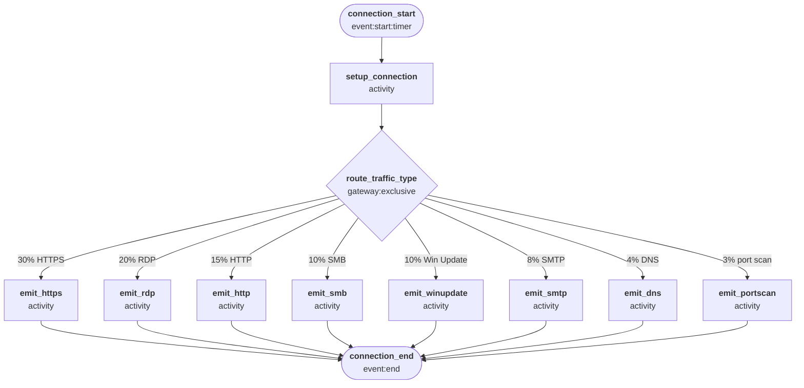

# Endpoint Network Traffic

Simulates the network activity seen by an internet-facing Windows host: inbound HTTP/HTTPS, RDP brute-force attempts, SMB probes, SMTP, and port scanning — plus outbound DNS and Windows Update traffic.

**Actor:** A connection attempt arriving at (or leaving) a Windows endpoint. Each worker represents one packet decision: the firewall either ALLOWs or DROPs it, and the worker stops.

## Quick start

```bash
# Windows Firewall Log
python generator.py -c presets/configs/endpoint_network.json --template WindowsFirewallLog -n 500 -s "2025-01-01T00:00"

# One day of data
python generator.py -c presets/configs/endpoint_network.json --template WindowsFirewallLog -r P1D -s "2025-01-01T00:00"
```

## Templates

| Template | Output |
| --- | --- |
| `WindowsFirewallLog` | Windows Firewall Log (`pfirewall.log` format) |

## Output fields

| Field | Description |
| --- | --- |
| `date` | Date of the event |
| `time` | Time of the event |
| `win_action` | `ALLOW` or `DROP` |
| `transport` | `TCP`, `UDP` |
| `src` | Source IP address |
| `dest` | Destination IP address |
| `src_port` | Source port |
| `dest_port` | Destination port |
| `size` | Packet size in bytes |
| `direction` | `SEND` (outbound) or `RECEIVE` (inbound) |

TCP/ICMP-specific fields (`tcpflags`, `tcpsyn`, `tcpack`, `tcpwin`, `icmptype`, `icmpcode`, `info`, `process_id`) are emitted as `-`.

## Traffic mix

| Traffic type | Weight | Port | Direction | ALLOW rate |
| --- | --- | --- | --- | --- |
| HTTPS | 30% | 443 | RECEIVE | 85% |
| HTTP | 15% | 80 | RECEIVE | 80% |
| RDP | 20% | 3389 | RECEIVE | 25% |
| SMB | 10% | 445 | RECEIVE | 0% |
| SMTP | 8% | 25 | RECEIVE | 60% |
| Port scan | 3% | random | RECEIVE | 0% |
| DNS | 4% | 53 | SEND | 100% |
| Windows Update / telemetry | 10% | 443 | SEND | 100% |

RDP and SMB reflect realistic internet exposure: RDP is a common brute-force target, and SMB should never be reachable from the internet.

## State machine

Each worker represents one packet decision — instantaneous, no timer states. The Actor is routed to a traffic-type emit state based on the configured mix, emits one record, and stops.



## Concurrency (`-m`)

All states have zero delay — each worker completes a single packet decision instantaneously. Session duration W ≈ 0, so `-m 1` is always sufficient. Adding workers has no practical effect.
