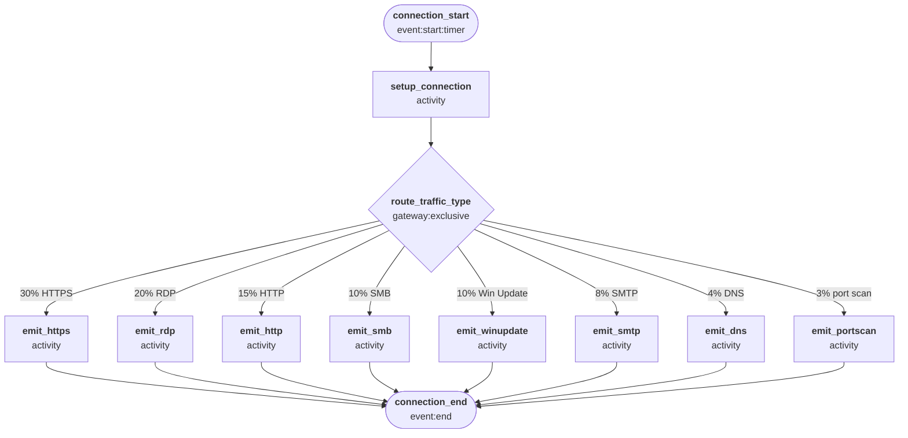
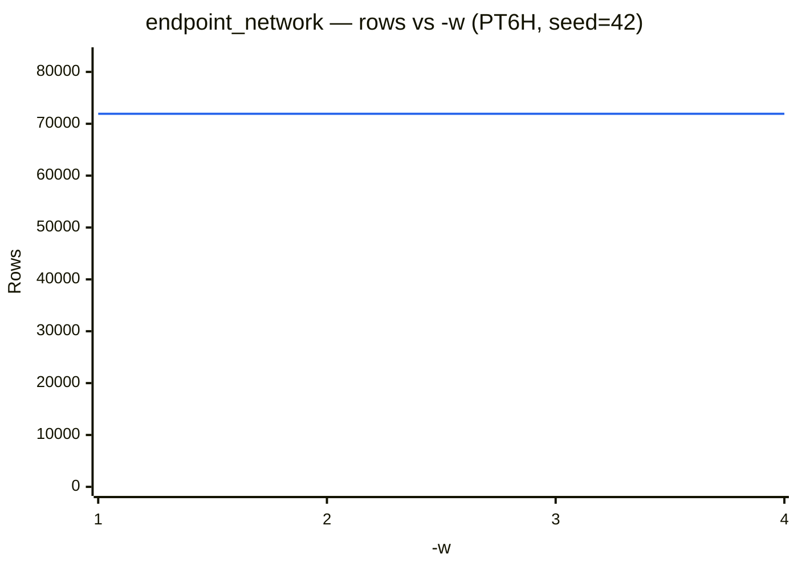

# Endpoint Network Traffic

Simulates the network activity seen by an internet-facing Windows host: inbound
HTTP/HTTPS, RDP brute-force attempts, SMB probes, SMTP, and port scanning — plus
outbound DNS and Windows Update traffic.

**Actor:** A connection attempt arriving at (or leaving) a Windows endpoint.
Each worker represents one packet decision: the firewall either ALLOWs or DROPs
it, and the worker stops.

## Quick start

```bash
# Windows Firewall Log
python generator.py -c presets/configs/endpoint_network.json --template \
  WindowsFirewallLog -n 500 -s "2025-01-01T00:00"

# One day of data
python generator.py -c presets/configs/endpoint_network.json --template \
  WindowsFirewallLog -r P1D -s "2025-01-01T00:00"

# OCSF Network Activity (security data lake / SIEM ingestion)
python generator.py -c presets/configs/endpoint_network.json --template \
  ocsf:network_activity -r P1D -s "2025-01-01T00:00"
```

## Templates

| Template | Output |
| --- | --- |
| `WindowsFirewallLog` | Windows Firewall Log (`pfirewall.log` format) |
| `ocsf:network_activity` | [OCSF](https://schema.ocsf.io/) 1.4.0 Network Activity (`class_uid` 4001) JSON — one event per packet decision, for security data lake / SIEM ingestion |

The `ocsf:network_activity` template maps each ALLOW/DROP decision to
`activity_id` 1 ("Open") or 5 ("Refuse") respectively, unlike the
`vpc_flow_logs` OCSF template which uses a constant `activity_id` 6 ("Traffic")
— this config's Actor represents a single per-packet firewall decision rather
than an aggregated flow, so a discrete open/refuse activity is the better fit.
`direction_id` comes directly from the `direction` field (`RECEIVE`→Inbound,
`SEND`→Outbound); `boundary_id` is a constant `3` (External), since every flow
in this config is between the local host and the internet. Verified against the
real OCSF 1.4.0 `network_activity` JSON Schema across 24K generated records (0
violations).

## Output fields

| Field | Description |
| --- | --- |
| `date` | Date of the event |
| `time` | Time of the event |
| `win_action` | `ALLOW` or `DROP` |
| `transport` | `TCP`, `UDP` |
| `src` | Source IP address |
| `dest` | Destination IP address |
| `src_port` | Source port |
| `dest_port` | Destination port |
| `size` | Packet size in bytes |
| `direction` | `SEND` (outbound) or `RECEIVE` (inbound) |

TCP/ICMP-specific fields (`tcpflags`, `tcpsyn`, `tcpack`, `tcpwin`, `icmptype`,
`icmpcode`, `info`, `process_id`) are emitted as `-`.

## Traffic mix

| Traffic type | Weight | Port | Direction | ALLOW rate |
| --- | --- | --- | --- | --- |
| HTTPS | 30% | 443 | RECEIVE | 85% |
| HTTP | 15% | 80 | RECEIVE | 80% |
| RDP | 20% | 3389 | RECEIVE | 25% |
| SMB | 10% | 445 | RECEIVE | 0% |
| SMTP | 8% | 25 | RECEIVE | 60% |
| Port scan | 3% | random | RECEIVE | 0% |
| DNS | 4% | 53 | SEND | 100% |
| Windows Update / telemetry | 10% | 443 | SEND | 100% |

RDP and SMB reflect realistic internet exposure: RDP is a common brute-force
target, and SMB should never be reachable from the internet.

## State machine

Each worker represents one packet decision — instantaneous, no timer states. The
Actor is routed to a traffic-type emit state based on the configured mix, emits
one record, and stops.


```mermaid
flowchart TD
    A(["<b>connection_start</b><br/>event:start:timer"]) --> B["<b>setup_connection</b><br/>activity"]
    B --> C{"<b>route_traffic_type</b><br/>gateway:exclusive"}
    C -->|"30% HTTPS"| D["<b>emit_https</b><br/>activity"]
    C -->|"20% RDP"| E["<b>emit_rdp</b><br/>activity"]
    C -->|"15% HTTP"| F["<b>emit_http</b><br/>activity"]
    C -->|"10% SMB"| G["<b>emit_smb</b><br/>activity"]
    C -->|"10% Win Update"| H["<b>emit_winupdate</b><br/>activity"]
    C -->|"8% SMTP"| I["<b>emit_smtp</b><br/>activity"]
    C -->|"4% DNS"| J["<b>emit_dns</b><br/>activity"]
    C -->|"3% port scan"| K["<b>emit_portscan</b><br/>activity"]
    D & E & F & G & H & I & J & K --> Z(["<b>connection_end</b><br/>event:end"])
```

## Volume

There is no meaningful `-w` ceiling. Each worker completes a single packet
decision with zero delay and immediately exits, so the worker pool is never the
bottleneck. `-w 1` is always sufficient; raising it has no effect on throughput.

The start interval is the only lever that controls volume here. The chart below
shows how output scales with workers (varying `-w`) with the preset's default
start interval (`--seed 42`, no schedule, PT6H simulated window) — flat, as
expected. To regenerate: `python tools/bench_config_workers.py -c
presets/configs/endpoint_network.json`.


```mermaid
%%{init: {'themeVariables': {'xyChart': {'plotColorPalette': '#2563eb'}}}}%%
xychart-beta
    title "endpoint_network — rows vs -w (PT6H, seed=42)"
    x-axis "-w" [1, 2, 3, 4]
    y-axis "Rows" 0 --> 83000
    line [71928, 71928, 71928, 71928]
```

Adjust `-i` to model heavier network traffic — `-w` won't help. The table below
illustrates how output scales across `-w` and `-i` together (`--seed 42`, no
schedule, PT6H simulated window). To regenerate: `python tools/bench_grid.py -c
presets/configs/endpoint_network.json`.

| `-i` \ `-w` | 1 | 5 | 25 | 100 | 250 | 1,000 | 2,500 | 5,000 |
| :--- | :--- | :--- | :--- | :--- | :--- | :--- | :--- | :--- |
| 0.01 | 🟥 2,158,856 (60.1s) | ↔️ | ↔️ | ↔️ | ↔️ | ↔️ | ↔️ | ↔️ |
| 0.1 | 🟧 215,894 (6.1s) | ↔️ | ↔️ | ↔️ | ↔️ | ↔️ | ↔️ | ↔️ |
| 0.3 (default) | 🟨 71,819 (2.1s) | ↔️ | ↔️ | ↔️ | ↔️ | ↔️ | ↔️ | ↔️ |
| 1 | 🟩 21,499 (0.9s) | ↔️ | ↔️ | ↔️ | ↔️ | ↔️ | ↔️ | ↔️ |

💥 = Crashed. ⏱️ = Timeout. ↔️ = Plateau -- increasing -w had
no effect. ↕️ = Plateau -- decreasing -i had no effect. (Ns) = wall-clock
seconds for that cell's own run -- not shown for skipped/plateau cells, which
were never actually run.
