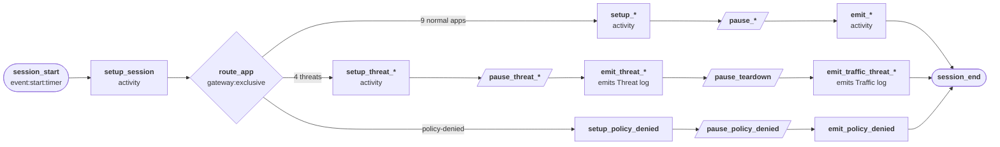
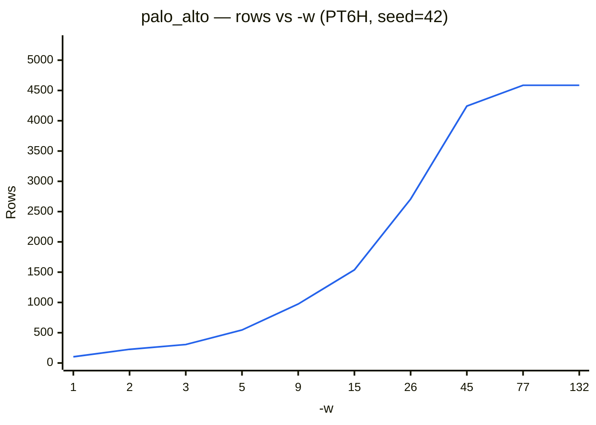

# Palo Alto Networks (PAN-OS)

Simulates PAN-OS firewall session logs — one Traffic log per session, plus a Threat log for any session terminated by a threat detection mid-session.

## Quick start

```bash
python generator.py -c presets/configs/palo_alto.json --template pan:syslog -n 500 -s "2025-01-01T00:00"

# One day of data
python generator.py -c presets/configs/palo_alto.json --template pan:syslog -r P1D -s "2025-01-01T00:00"

# Compact JSON view
python generator.py -c presets/configs/palo_alto.json --template compact -r P1D -s "2025-01-01T00:00"
```

## Templates

| Template | Output |
| --- | --- |
| `pan:syslog` | Authentic PAN-OS syslog CSV — branches per record on `log_type`, rendering the real 117-column TRAFFIC or 123-column THREAT layout |
| `compact` | Trimmed JSON view with only the fields that vary meaningfully — the same underlying record, fewer fields rendered |

This config has two emitters — `pan_traffic_log` and `pan_threat_log` — with genuinely different field counts and orders, matching the real vendor layouts. `--template` applies one Jinja template globally to every emitted record regardless of source emitter, so a template can't be scoped per-emitter; `pan:syslog` handles this correctly by branching on the record's own `log_type` field rather than assuming a fixed shape, which also matches how a real PAN-OS syslog destination receives one mixed stream of both log types. `compact` sidesteps the issue by rendering only fields common or gracefully defaulted across both types.

## Output fields

Every record carries the full real PAN-OS field set for its log type (117 columns for Traffic, 123 for Threat) — most fields outside the list below are present but blank, matching a single-firewall deployment with no SD-WAN, containers, 5G, or Panorama hierarchy configured.

| Field | Description |
| --- | --- |
| `log_type` | `TRAFFIC` or `THREAT` |
| `log_subtype` | `end` (normal/threat-terminated session) or `deny` (denied before an app was identified) — Traffic only; Threat uses its own profile subtype (`spyware`/`url`/`vulnerability`/`flood`) |
| `generated_time` / `receive_time` | Timestamp the log was generated/received |
| `start_time` | Session start timestamp (Traffic only) |
| `duration` | Session duration in seconds (Traffic only) |
| `src_ip` / `dest_ip` | Client and destination IP addresses |
| `src_user` | User-ID, UPN format |
| `app` | App-ID (real Palo Alto application signature name) |
| `rule` | Matched security policy rule name |
| `action` | Vendor action term (`allow`, `deny`, `reset-both`) |
| `session_end_reason` | `tcp-fin`, `aged-out`, `threat`, or `policy-deny` (Traffic only) |
| `bytes` / `bytes_in` / `bytes_out` | Byte counts |
| `packets` / `packets_in` / `packets_out` | Packet counts |
| `dest_port` / `transport` | Destination port and protocol |
| `dest_location` | Destination country code |
| `category_of_app` / `subcategory_of_app` / `technology_of_app` / `risk_of_app` | App-ID metadata (real `app_list.csv` values) |
| `http_category` | URL category, where identified |
| `threat` | `"<threat name>(<threat ID>)"` — Threat only |
| `threat_category` / `severity` | Threat classification and severity — Threat only |
| `direction` | Attack direction — Threat only |

## Session categories

Each session is routed to one of App-ID + rule profile, real values from `app_list.csv`/`threat_list.csv`:

| Category | Share of sessions | Outcome |
| --- | --- | --- |
| Microsoft 365 | 18% | Allowed |
| Salesforce | 7% | Allowed |
| Slack | 6% | Allowed |
| Web browsing | 14% | Allowed |
| YouTube | 8% | Allowed, high-volume |
| LinkedIn | 9% | Allowed |
| Dropbox | 7% | Allowed |
| DNS | 10% | Allowed, near-instant |
| Generic SSL | 11% | Allowed |
| Bot C2 beacon (Mariposa) | 2% | Threat — reset, session ends |
| Phishing webpage | 2% | Threat — reset, session ends |
| Buffer overflow exploit | 1% | Threat — reset, session ends |
| DDoS flood (LOIC) | 1% | Threat — reset, session ends |
| Policy-denied (unidentified app) | 4% | Denied before app identification |

## State machine

Each worker represents one firewall session. Unlike a multi-transaction browsing session, a PAN-OS session emits exactly one Traffic log (at teardown) — plus one Threat log, mid-session, for the four threat-triggered branches.



## Volume

The default start interval for workers in this preset is 5 seconds, with each worker busy for 330 seconds on average. The maximum number of workers that can be busy at the same time is therefore 330/5 = 66; increasing available workers (using `-w`) without adjusting how often they begin work (using `-i`) has no effect.

The chart below shows how output scales with workers (varying `-w`) with the preset's default start interval (`--seed 42`, no schedule, PT6H simulated window). To regenerate: `python tools/bench_config_workers.py -c presets/configs/palo_alto.json --clock-field start_time`.



Adjust `-i` and `-w` to model heavier firewall traffic. The table below illustrates how output scales across `-w` and `-i` together (`--seed 42`, no schedule, PT6H simulated window). To regenerate: `python tools/bench_grid.py -c presets/configs/palo_alto.json`.

| `-i` \ `-w` | 1 | 5 | 25 | 100 | 250 | 1,000 | 2,500 | 5,000 |
| :--- | :--- | :--- | :--- | :--- | :--- | :--- | :--- | :--- |
| 0.01 | 🟩 99 (2.6s) | ↕️ | ↕️ | 🟧 10,949 (4.1s) | 🟧 26,640 (6.5s) | 🟥 106,607 (16.3s) | 🟥 267,596 (32.7s) | 🟥 535,070 (65.8s) |
| 0.1 | 🟩 104 (0.5s) | 🟩 552 (0.6s) | 🟨 2,633 (0.8s) | 🟧 10,188 (1.7s) | 🟧 26,584 (3.7s) | 🟥 107,479 (13.6s) | 🟥 225,949 (26.2s) | ↔️ |
| 1 | 🟩 96 (0.2s) | 🟩 507 (0.3s) | 🟨 2,653 (0.6s) | 🟧 10,723 (1.4s) | 🟧 22,570 (2.8s) | 🟧 22,828 (2.9s) | ↔️ | ↔️ |
| 5 (default) | 🟩 85 (0.2s) | 🟩 514 (0.3s) | 🟨 2,517 (0.5s) | 🟨 4,536 (0.8s) | ↔️ | ↔️ | ↔️ | ↔️ |

💥 = thread-creation limit hit. ⏱️ = Timeout. ↔️ = Plateau -- increasing -w had no effect. ↕️ = Plateau -- decreasing -i had no effect. (Ns) = wall-clock seconds for that cell's own run -- not shown for skipped/plateau cells, which were never actually run.
