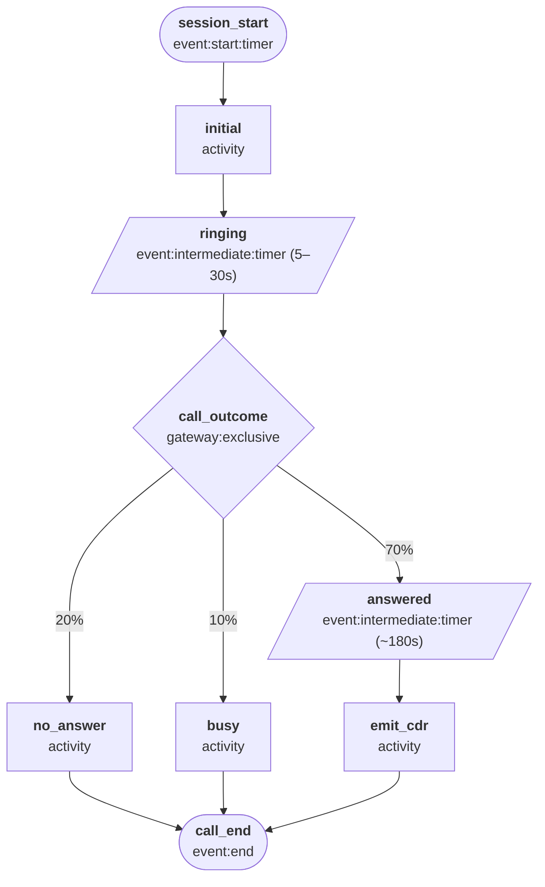
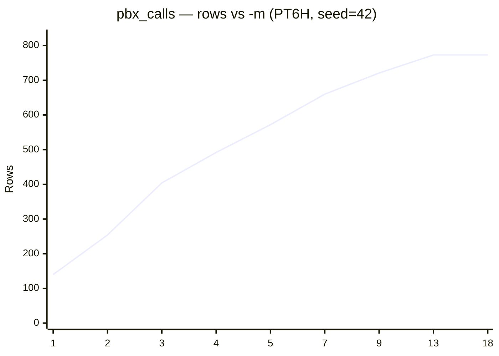

# PBX Calls

Simulates Asterisk IP PBX call detail records (`asterisk_cdr` sourcetype). Models the full call lifecycle from dialling through to completion, with realistic outcomes and durations.

**Actor:** A caller making a phone call. Each worker represents one person picking up the phone, waiting for an answer, and either completing the call or hanging up.

## Quick start

```bash
python generator.py -c presets/configs/pbx_calls.json --template asterisk_cdr -n 100 -s "2025-01-01T00:00"

# One hour of data
python generator.py -c presets/configs/pbx_calls.json --template asterisk_cdr -r PT1H -s "2025-01-01T00:00"

# Concurrent callers
python generator.py -c presets/configs/pbx_calls.json --template asterisk_cdr -r PT1H -s "2025-01-01T00:00" -m 5
```

## Template

| Template | Output |
| --- | --- |
| `asterisk_cdr` | Asterisk CDR CSV format |

## Output fields

| Field | Description |
| --- | --- |
| `accountcode` | Account code (`sales`, `support`, `billing`, or empty) |
| `src` | Caller phone number (10-digit) |
| `dst` | Destination extension (4-digit) |
| `clid` | Caller ID (same as `src`) |
| `channel` | Originating SIP channel |
| `dstchannel` | Destination SIP channel (empty if unanswered) |
| `lastapp` | Last Asterisk application executed (`Dial`) |
| `lastdata` | Arguments to `lastapp` |
| `start` | Call start timestamp |
| `answer` | Answer timestamp (same as `start`) |
| `end` | Call end timestamp (same as `start`) |
| `duration` | Total call duration in seconds |
| `billsec` | Billable seconds (`duration` for ANSWERED, `0` otherwise) |
| `disposition` | Call outcome: `ANSWERED`, `NO ANSWER`, or `BUSY` |
| `amaflags` | AMA flags (always `DOCUMENTATION`) |

> `start`, `answer`, and `end` all carry the same clock timestamp since the generator emits the CDR as a single event at call completion. Use `duration` and `billsec` for time-range analysis.

## State machine



The `ringing` state models real ring time (5–30 s) before the outcome is determined. Answered calls spend an additional ~3 minutes in `answered` before the CDR is emitted — so `-m` controls how many calls are genuinely in progress simultaneously, in both real-time and simulated modes.

## Concurrency (`-m`)

The `-m` ceiling is ~9. Setting `-m` above this has no effect — the worker pool is never fully used. To model a busier PBX, lower the `interarrival` mean in the config.

The table below shows how output scales with `-m` (`--seed 42`, no schedule, PT6H simulated window). To regenerate: `python tools/bench_config.py -c presets/configs/pbx_calls.json`.

| `-m` | Rows (PT6H) | Wall-clock (s) |
| ---: | ---: | ---: |
| 1 | 140 | 0.2 |
| 2 | 254 | 0.2 |
| 3 | 404 | 0.2 |
| 4 | 492 | 0.2 |
| 5 | 572 | 0.2 |
| 7 | 660 | 0.2 |
| 9 | 721 | 0.2 |
| 13 | 773 | 0.2 |
| 18 | 773 | 0.2 |


