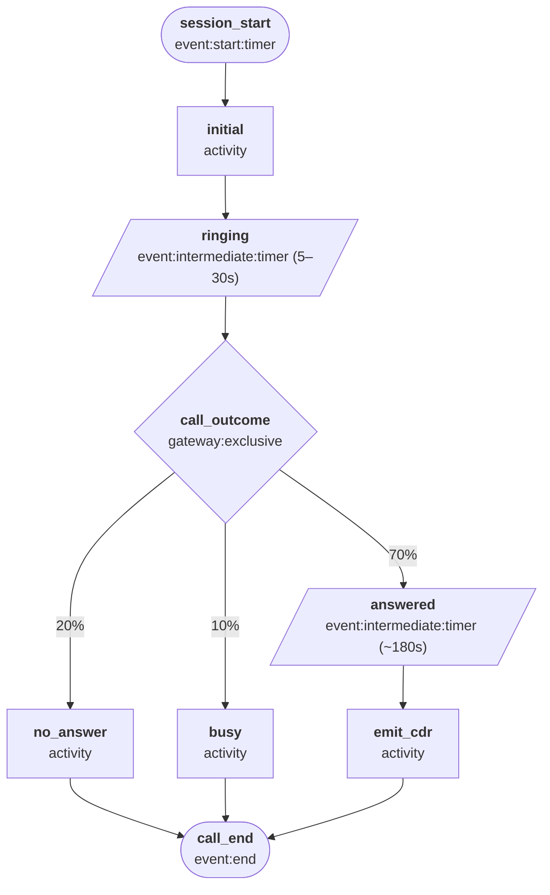
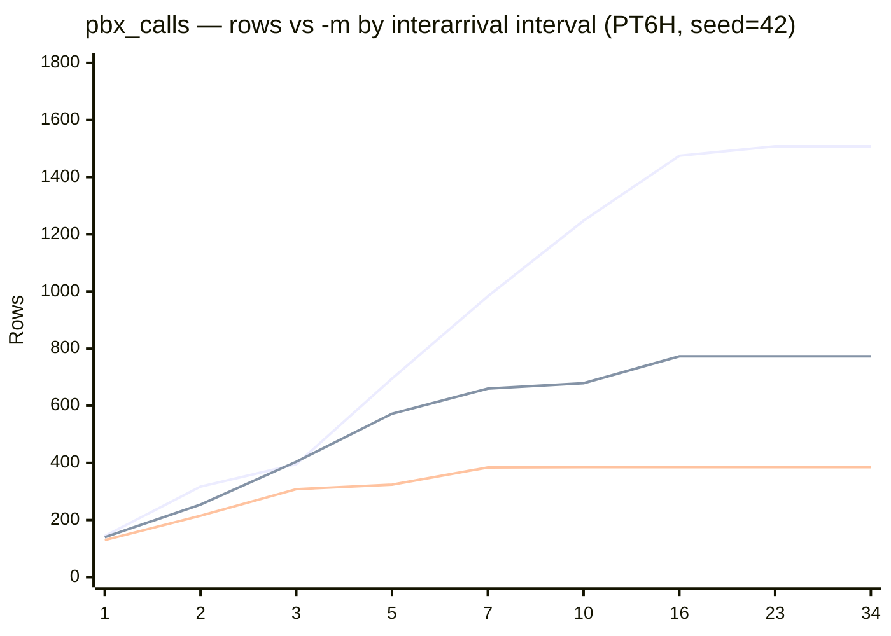

# PBX Calls

Simulates Asterisk IP PBX call detail records (`asterisk_cdr` sourcetype). Models the full call lifecycle from dialling through to completion, with realistic outcomes and durations.

**Actor:** A caller making a phone call. Each worker represents one person picking up the phone, waiting for an answer, and either completing the call or hanging up.

## Quick start

```bash
python generator.py -c presets/configs/pbx_calls.json --template asterisk_cdr -n 100 -s "2025-01-01T00:00"

# One hour of data
python generator.py -c presets/configs/pbx_calls.json --template asterisk_cdr -r PT1H -s "2025-01-01T00:00"

# Concurrent callers
python generator.py -c presets/configs/pbx_calls.json --template asterisk_cdr -r PT1H -s "2025-01-01T00:00" -m 5
```

## Template

| Template | Output |
| --- | --- |
| `asterisk_cdr` | Asterisk CDR CSV format |

## Output fields

| Field | Description |
| --- | --- |
| `accountcode` | Account code (`sales`, `support`, `billing`, or empty) |
| `src` | Caller phone number (10-digit) |
| `dst` | Destination extension (4-digit) |
| `clid` | Caller ID (same as `src`) |
| `channel` | Originating SIP channel |
| `dstchannel` | Destination SIP channel (empty if unanswered) |
| `lastapp` | Last Asterisk application executed (`Dial`) |
| `lastdata` | Arguments to `lastapp` |
| `start` | Call start timestamp |
| `answer` | Answer timestamp (same as `start`) |
| `end` | Call end timestamp (same as `start`) |
| `duration` | Total call duration in seconds |
| `billsec` | Billable seconds (`duration` for ANSWERED, `0` otherwise) |
| `disposition` | Call outcome: `ANSWERED`, `NO ANSWER`, or `BUSY` |
| `amaflags` | AMA flags (always `DOCUMENTATION`) |

> `start`, `answer`, and `end` all carry the same clock timestamp since the generator emits the CDR as a single event at call completion. Use `duration` and `billsec` for time-range analysis.

## State machine


```mermaid
flowchart TD
    A(["<b>session_start</b><br/>event:start:timer"]) --> B["<b>initial</b><br/>activity"]
    B --> C[/"<b>ringing</b><br/>event:intermediate:timer (5–30s)"/]
    C --> D{"<b>call_outcome</b><br/>gateway:exclusive"}
    D -->|"70%"| E[/"<b>answered</b><br/>event:intermediate:timer (~180s)"/]
    D -->|"20%"| F["<b>no_answer</b><br/>activity"]
    D -->|"10%"| G["<b>busy</b><br/>activity"]
    E --> H["<b>emit_cdr</b><br/>activity"]
    F --> Z(["<b>call_end</b><br/>event:end"])
    G --> Z
    H --> Z
```

The `ringing` state models real ring time (5–30 s) before the outcome is determined. Answered calls spend an additional ~3 minutes in `answered` before the CDR is emitted — so `-m` controls how many calls are genuinely in progress simultaneously, in both real-time and simulated modes.

## Volume

The `-m` ceiling at the preset's default interarrival interval is ~9. Setting `-m` above this has no effect — the worker pool is never fully used. To model a busier PBX, lower the interarrival interval instead (via `--start-interval`, or by editing the config's `event:start:timer` directly).

Halving the interval (2x arrival rate) raises the ceiling to ~17; doubling it (0.5x arrival rate) lowers it to ~9. The ceiling scales with arrival rate. At this preset's low call volume, treat these as approximate rather than exact.

The table below shows how output scales with `-m` at each interval (`--seed 42`, no schedule, PT6H simulated window). To regenerate: `python tools/bench_config.py -c presets/configs/pbx_calls.json --compare-start-interval`.

| `-m` | Rows — 1/2x interval | Rows — default | Rows — 2x interval |
| ---: | ---: | ---: | ---: |
| 1 | 144 | 140 | 130 |
| 2 | 317 | 254 | 215 |
| 3 | 395 | 404 | 308 |
| 5 | 695 | 572 | 324 |
| 7 | 983 | 660 | 384 |
| 10 | 1,248 | 679 | 385 |
| 16 | 1,475 | 773 | 385 |
| 23 | 1,508 | 773 | 385 |
| 34 | 1,508 | 773 | 385 |


```mermaid
xychart-beta
    title "pbx_calls — rows vs -m by interarrival interval (PT6H, seed=42)"
    x-axis [1, 2, 3, 5, 7, 10, 16, 23, 34]
    y-axis "Rows" 0 --> 1800
    line [144, 317, 395, 695, 983, 1248, 1475, 1508, 1508]
    line [140, 254, 404, 572, 660, 679, 773, 773, 773]
    line [130, 215, 308, 324, 384, 385, 385, 385, 385]
```
