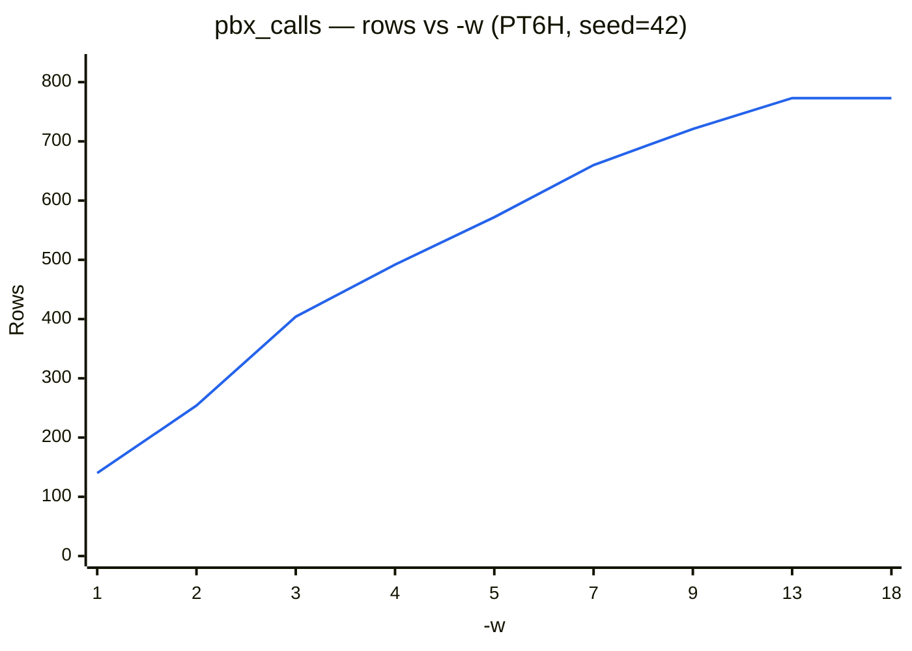

# PBX Calls

Simulates Asterisk IP PBX call detail records (`asterisk_cdr` sourcetype). Models the full call lifecycle from dialling through to completion, with realistic outcomes and durations.

**Actor:** A caller making a phone call. Each worker represents one person picking up the phone, waiting for an answer, and either completing the call or hanging up.

## Quick start

```bash
python generator.py -c presets/configs/pbx_calls.json --template asterisk_cdr -n 100 -s "2025-01-01T00:00"

# One hour of data
python generator.py -c presets/configs/pbx_calls.json --template asterisk_cdr -r PT1H -s "2025-01-01T00:00"

# Concurrent callers
python generator.py -c presets/configs/pbx_calls.json --template asterisk_cdr -r PT1H -s "2025-01-01T00:00" -w 5
```

## Template

| Template | Output |
| --- | --- |
| `asterisk_cdr` | Asterisk CDR CSV format |

## Output fields

| Field | Description |
| --- | --- |
| `accountcode` | Account code (`sales`, `support`, `billing`, or empty) |
| `src` | Caller phone number (10-digit) |
| `dst` | Destination extension (4-digit) |
| `clid` | Caller ID (same as `src`) |
| `channel` | Originating SIP channel |
| `dstchannel` | Destination SIP channel (empty if unanswered) |
| `lastapp` | Last Asterisk application executed (`Dial`) |
| `lastdata` | Arguments to `lastapp` |
| `start` | Call start timestamp |
| `answer` | Answer timestamp (same as `start`) |
| `end` | Call end timestamp (same as `start`) |
| `duration` | Total call duration in seconds |
| `billsec` | Billable seconds (`duration` for ANSWERED, `0` otherwise) |
| `disposition` | Call outcome: `ANSWERED`, `NO ANSWER`, or `BUSY` |
| `amaflags` | AMA flags (always `DOCUMENTATION`) |

> `start`, `answer`, and `end` all carry the same clock timestamp since the generator emits the CDR as a single event at call completion. Use `duration` and `billsec` for time-range analysis.

## State machine


```mermaid
flowchart TD
    A(["<b>session_start</b><br/>event:start:timer"]) --> B["<b>initial</b><br/>activity"]
    B --> C[/"<b>ringing</b><br/>event:intermediate:timer (5–30s)"/]
    C --> D{"<b>call_outcome</b><br/>gateway:exclusive"}
    D -->|"70%"| E[/"<b>answered</b><br/>event:intermediate:timer (~180s)"/]
    D -->|"20%"| F["<b>no_answer</b><br/>activity"]
    D -->|"10%"| G["<b>busy</b><br/>activity"]
    E --> H["<b>emit_cdr</b><br/>activity"]
    F --> Z(["<b>call_end</b><br/>event:end"])
    G --> Z
    H --> Z
```

The `ringing` state models real ring time (5–30 s) before the outcome is determined. Answered calls spend an additional ~3 minutes in `answered` before the CDR is emitted — so `-w` controls how many calls are genuinely in progress simultaneously, in both real-time and simulated modes.

## Volume

The default start interval for workers in this preset is 30 seconds, with each worker busy for 270 seconds on average. The maximum number of workers that can be busy at the same time is therefore 270/30 = 9; increasing available workers (using `-w`) without adjusting how often they begin work (using `-i`) has no effect. At this preset's low volume, treat this as approximate rather than exact.

The chart below shows how output scales with workers (varying `-w`) with the preset's default start interval (`--seed 42`, no schedule, PT6H simulated window). To regenerate: `python tools/bench_config_workers.py -c presets/configs/pbx_calls.json`.


```mermaid
%%{init: {'themeVariables': {'xyChart': {'plotColorPalette': '#2563eb'}}}}%%
xychart-beta
    title "pbx_calls — rows vs -w (PT6H, seed=42)"
    x-axis "-w" [1, 2, 3, 4, 5, 7, 9, 13, 18]
    y-axis "Rows" 0 --> 830
    line [140, 254, 404, 492, 572, 660, 721, 773, 773]
```

Adjust `-i` and `-w` to model a busier PBX. The table below illustrates how output scales across `-w` and `-i` together (`--seed 42`, no schedule, PT6H simulated window). To regenerate: `python tools/bench_grid.py -c presets/configs/pbx_calls.json`.

| `-i` \ `-w` | 1 | 5 | 25 | 100 | 250 | 1,000 | 2,500 | 5,000 |
| :--- | :--- | :--- | :--- | :--- | :--- | :--- | :--- | :--- |
| 0.01 | ↕️ | 🟩 755 (0.2s) | 🟨 3,632 (0.5s) | 🟧 15,199 (1.7s) | 🟧 37,329 (4.0s) | 🟥 148,171 (19.1s) | 🟥 371,580 (71.4s) | 🟥 744,224 (249.6s) |
| 0.1 | ↕️ | 🟩 717 (0.3s) | 🟨 3,615 (0.5s) | 🟧 14,953 (1.6s) | 🟧 36,938 (4.0s) | 🟥 147,428 (20.2s) | 🟥 213,650 (34.4s) | ↔️ |
| 1 | 🟩 147 (0.2s) | 🟩 774 (0.3s) | 🟨 3,607 (0.5s) | 🟧 14,552 (1.6s) | 🟧 21,551 (2.3s) | ↔️ | ↔️ | ↔️ |
| 30 (default) | 🟩 140 (0.2s) | 🟩 572 (0.3s) | 🟩 773 (0.3s) | ↔️ | ↔️ | ↔️ | ↔️ | ↔️ |

💥 = thread-creation limit hit. ⏱️ = Timeout. ↔️ = Plateau -- increasing -w had no effect. ↕️ = Plateau -- decreasing -i had no effect. (Ns) = wall-clock seconds for that cell's own run -- not shown for skipped/plateau cells, which were never actually run.
