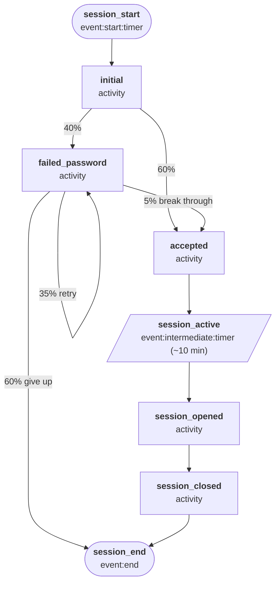

# SSH Authentication

Simulates Linux SSH authentication logs (`linux_secure` sourcetype) for a small cluster of servers. Models the full connection lifecycle including brute-force attempt loops, successful logins, and session open/close pairs.

**Actor:** A remote client connecting to an SSH server. Each worker represents one connection attempt from one source IP.

## Quick start

```bash
python generator.py -c presets/configs/ssh_auth.json --template linux_secure -n 100 -s "2025-01-01T00:00"

# One hour of data
python generator.py -c presets/configs/ssh_auth.json --template linux_secure -r PT1H -s "2025-01-01T00:00"

# Concurrent connections
python generator.py -c presets/configs/ssh_auth.json --template linux_secure -r PT1H -s "2025-01-01T00:00" -m 20
```

## Template

| Template | Output |
| --- | --- |
| `linux_secure` | Standard Linux syslog format (`/var/log/secure`) |

## Output fields

| Field | Description |
| --- | --- |
| `time` | Event timestamp (`%b %d %H:%M:%S`) |
| `hostname` | Server hostname |
| `pid` | sshd process ID |
| `action` | Auth result or session action (e.g. `Failed password`, `Accepted password`, `session opened`) |
| `user` | Target username |
| `src_ip` | Source IP address (auth lines only) |
| `src_port` | Source port (auth lines only) |

## State machine



Variables set in `initial` (hostname, username, source IP, port, PID) persist for the entire connection lifecycle. Failed password attempts self-loop with 35% probability, giving realistic brute-force bursts. A failed session can break through to `accepted` with 5% probability, or give up with 60%.

Session dwell time is drawn from an exponential distribution with mean 600 seconds (~10 minutes).

## Concurrency (`-m`)

| Little's Law component | Value |
| --- | --- |
| Average session duration (W) | ~381 seconds |
| Interarrival mean | 10 s |
| Base arrival rate (λ = 1/mean) | 0.1 connections/sec |
| Maximum useful `-m` (L = λW) | ~38 |

Setting `-m` above ~38 has no effect — connections complete faster than new ones arrive to fill the pool.
