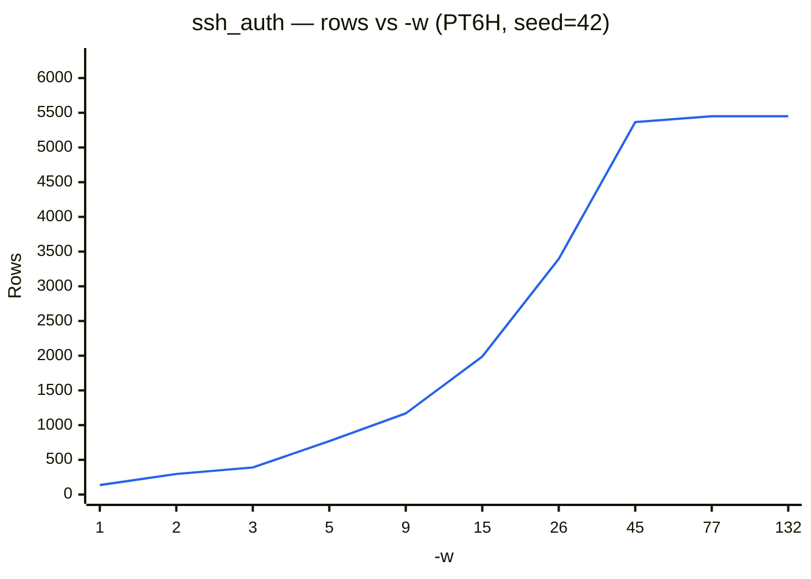

# SSH Authentication

Simulates Linux SSH authentication logs (`linux_secure` sourcetype) for a small
cluster of servers. Models the full connection lifecycle including brute-force
attempt loops, successful logins, and session open/close pairs.

**Actor:** A remote client connecting to an SSH server. Each worker represents
one connection attempt from one source IP.

## Quick start

```bash
python generator.py -c presets/configs/ssh_auth.json --template linux_secure \
  -n 100 -s "2025-01-01T00:00"

# One hour of data
python generator.py -c presets/configs/ssh_auth.json --template linux_secure \
  -r PT1H -s "2025-01-01T00:00"

# Concurrent connections
python generator.py -c presets/configs/ssh_auth.json --template linux_secure \
  -r PT1H -s "2025-01-01T00:00" -w 20

# OCSF Authentication (security data lake / SIEM ingestion)
python generator.py -c presets/configs/ssh_auth.json --template \
  ocsf:authentication -r PT1H -s "2025-01-01T00:00"
```

## Templates

| Template | Output |
| --- | --- |
| `linux_secure` | Standard Linux syslog format (`/var/log/secure`) |
| `ocsf:authentication` | [OCSF](https://schema.ocsf.io/) 1.4.0 Authentication (`class_uid` 3002) JSON — one event per auth/session action, for security data lake / SIEM ingestion |

The `ocsf:authentication` template maps `Failed password`/`Accepted
password`/`session opened` to `activity_id` 1 ("Logon") and `session closed` to
2 ("Logoff"), with `status_id` following success/failure. `pid` (stable for the
life of a connection) becomes `session.uid`, correlating the full auth →
session-open → session-close lifecycle under one session identifier — matching
how real sshd log lines are correlated by PID. Verified against the real OCSF
1.4.0 `authentication` JSON Schema across 5,450 generated records (0
violations).

## Output fields

| Field | Description |
| --- | --- |
| `time` | Event timestamp (`%b %d %H:%M:%S`) |
| `hostname` | Server hostname |
| `pid` | sshd process ID |
| `action` | Auth result or session action (e.g. `Failed password`, `Accepted password`, `session opened`) |
| `user` | Target username |
| `src_ip` | Source IP address (auth lines only) |
| `src_port` | Source port (auth lines only) |

## State machine


```mermaid
flowchart TD
    A(["<b>session_start</b><br/>event:start:timer"]) --> B["<b>initial</b><br/>activity"]
    B -->|"40%"| C["<b>failed_password</b><br/>activity"]
    B -->|"60%"| D["<b>accepted</b><br/>activity"]
    C -->|"35% retry"| C
    C -->|"5% break through"| D
    C -->|"60% give up"| Z(["<b>session_end</b><br/>event:end"])
    D --> E[/"<b>session_active</b><br/>event:intermediate:timer (~10 min)"/]
    E --> F["<b>session_opened</b><br/>activity"]
    F --> G["<b>session_closed</b><br/>activity"]
    G --> Z
```

Variables set in `initial` (hostname, username, source IP, port, PID) persist
for the entire connection lifecycle. Failed password attempts self-loop with 35%
probability, giving realistic brute-force bursts. A failed session can break
through to `accepted` with 5% probability, or give up with 60%.

Session dwell time is drawn from an exponential distribution with mean 600
seconds (~10 minutes).

## Volume

The default start interval for workers in this preset is 10 seconds, with each
worker busy for 660 seconds on average. The maximum number of workers that can
be busy at the same time is therefore 660/10 = 66; increasing available workers
(using `-w`) without adjusting how often they begin work (using `-i`) has no
effect.

The chart below shows how output scales with workers (varying `-w`) with the
preset's default start interval (`--seed 42`, no schedule, PT6H simulated
window). To regenerate: `python tools/bench_config_workers.py -c
presets/configs/ssh_auth.json`.


```mermaid
%%{init: {'themeVariables': {'xyChart': {'plotColorPalette': '#2563eb'}}}}%%
xychart-beta
    title "ssh_auth — rows vs -w (PT6H, seed=42)"
    x-axis "-w" [1, 2, 3, 5, 9, 15, 26, 45, 77, 132]
    y-axis "Rows" 0 --> 6300
    line [136, 296, 390, 769, 1169, 1988, 3395, 5366, 5450, 5450]
```

Adjust `-i` and `-w` to model heavier SSH traffic. The table below illustrates
how output scales across `-w` and `-i` together (`--seed 42`, no schedule, PT6H
simulated window). To regenerate: `python tools/bench_grid.py -c
presets/configs/ssh_auth.json`.

| `-i` \ `-w` | 1 | 5 | 25 | 100 | 250 | 1,000 | 2,500 | 5,000 |
| :--- | :--- | :--- | :--- | :--- | :--- | :--- | :--- | :--- |
| 0.01 | 🟩 181 (2.6s) | 🟩 672 (2.8s) | ↕️ | 🟧 14,415 (3.5s) | 🟧 35,686 (4.2s) | 🟥 144,107 (7.5s) | 🟥 360,360 (14.9s) | 🟥 718,300 (30.8s) |
| 0.1 | 🟩 197 (0.4s) | 🟩 758 (0.5s) | 🟨 3,640 (0.6s) | 🟧 14,391 (0.8s) | 🟧 35,723 (1.3s) | 🟥 142,046 (4.1s) | 🟥 357,659 (11.3s) | 🟥 533,976 (18.4s) |
| 1 | 🟩 157 (0.2s) | 🟩 760 (0.2s) | 🟨 3,711 (0.3s) | 🟧 14,458 (0.6s) | 🟧 35,777 (1.0s) | 🟧 53,291 (1.5s) | ↔️ | ↔️ |
| 10 (default) | 🟩 146 (0.2s) | 🟩 663 (0.2s) | 🟨 3,442 (0.2s) | 🟨 5,522 (0.3s) | ↔️ | ↔️ | ↔️ | ↔️ |

💥 = Crashed. ⏱️ = Timeout. ↔️ = Plateau -- increasing -w had
no effect. ↕️ = Plateau -- decreasing -i had no effect. (Ns) = wall-clock
seconds for that cell's own run -- not shown for skipped/plateau cells, which
were never actually run.
