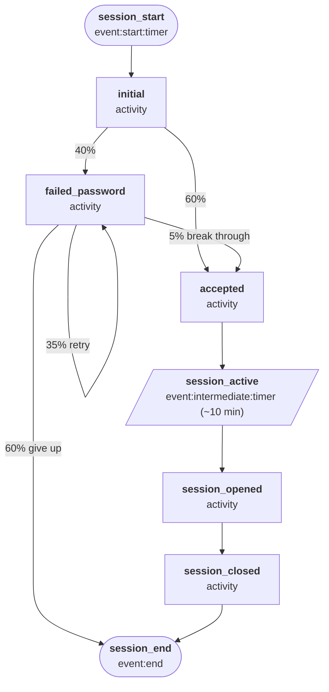
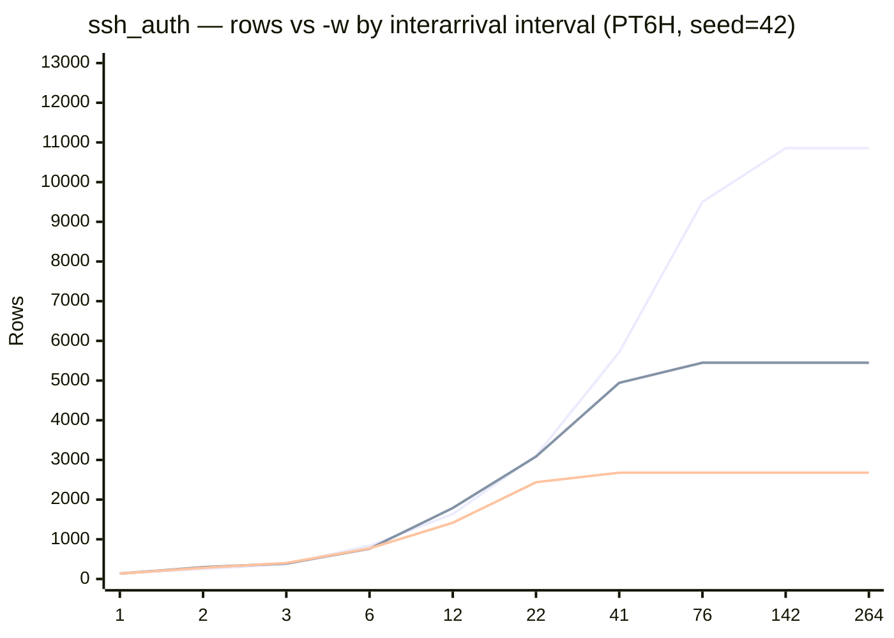

# SSH Authentication

Simulates Linux SSH authentication logs (`linux_secure` sourcetype) for a small cluster of servers. Models the full connection lifecycle including brute-force attempt loops, successful logins, and session open/close pairs.

**Actor:** A remote client connecting to an SSH server. Each worker represents one connection attempt from one source IP.

## Quick start

```bash
python generator.py -c presets/configs/ssh_auth.json --template linux_secure -n 100 -s "2025-01-01T00:00"

# One hour of data
python generator.py -c presets/configs/ssh_auth.json --template linux_secure -r PT1H -s "2025-01-01T00:00"

# Concurrent connections
python generator.py -c presets/configs/ssh_auth.json --template linux_secure -r PT1H -s "2025-01-01T00:00" -w 20

# OCSF Authentication (security data lake / SIEM ingestion)
python generator.py -c presets/configs/ssh_auth.json --template ocsf:authentication -r PT1H -s "2025-01-01T00:00"
```

## Templates

| Template | Output |
| --- | --- |
| `linux_secure` | Standard Linux syslog format (`/var/log/secure`) |
| `ocsf:authentication` | [OCSF](https://schema.ocsf.io/) 1.4.0 Authentication (`class_uid` 3002) JSON — one event per auth/session action, for security data lake / SIEM ingestion |

The `ocsf:authentication` template maps `Failed password`/`Accepted password`/`session opened` to `activity_id` 1 ("Logon") and `session closed` to 2 ("Logoff"), with `status_id` following success/failure. `pid` (stable for the life of a connection) becomes `session.uid`, correlating the full auth → session-open → session-close lifecycle under one session identifier — matching how real sshd log lines are correlated by PID. Verified against the real OCSF 1.4.0 `authentication` JSON Schema across 5,450 generated records (0 violations).

## Output fields

| Field | Description |
| --- | --- |
| `time` | Event timestamp (`%b %d %H:%M:%S`) |
| `hostname` | Server hostname |
| `pid` | sshd process ID |
| `action` | Auth result or session action (e.g. `Failed password`, `Accepted password`, `session opened`) |
| `user` | Target username |
| `src_ip` | Source IP address (auth lines only) |
| `src_port` | Source port (auth lines only) |

## State machine


```mermaid
flowchart TD
    A(["<b>session_start</b><br/>event:start:timer"]) --> B["<b>initial</b><br/>activity"]
    B -->|"40%"| C["<b>failed_password</b><br/>activity"]
    B -->|"60%"| D["<b>accepted</b><br/>activity"]
    C -->|"35% retry"| C
    C -->|"5% break through"| D
    C -->|"60% give up"| Z(["<b>session_end</b><br/>event:end"])
    D --> E[/"<b>session_active</b><br/>event:intermediate:timer (~10 min)"/]
    E --> F["<b>session_opened</b><br/>activity"]
    F --> G["<b>session_closed</b><br/>activity"]
    G --> Z
```

Variables set in `initial` (hostname, username, source IP, port, PID) persist for the entire connection lifecycle. Failed password attempts self-loop with 35% probability, giving realistic brute-force bursts. A failed session can break through to `accepted` with 5% probability, or give up with 60%.

Session dwell time is drawn from an exponential distribution with mean 600 seconds (~10 minutes).

## Volume

The `-w` ceiling at the preset's default interarrival interval is ~66. Setting `-w` above this has no effect — the worker pool is never fully used. To model heavier SSH traffic, lower the interarrival interval instead (via `-i`, or by editing the config's `event:start:timer` directly).

Halving the interval (2x arrival rate) raises the ceiling to ~132; doubling it (0.5x arrival rate) lowers it to ~33. The ceiling scales linearly with arrival rate.

The table below shows how output scales with `-w` at each interval (`--seed 42`, no schedule, PT6H simulated window). To regenerate: `python tools/bench_config.py -c presets/configs/ssh_auth.json --compare-start-interval`.

| `-w` | Rows — 1/2x interval | Rows — default | Rows — 2x interval |
| ---: | ---: | ---: | ---: |
| 1 | 136 | 136 | 136 |
| 2 | 247 | 296 | 280 |
| 3 | 375 | 390 | 404 |
| 6 | 840 | 762 | 769 |
| 12 | 1,635 | 1,789 | 1,417 |
| 22 | 3,107 | 3,084 | 2,437 |
| 41 | 5,714 | 4,942 | 2,679 |
| 76 | 9,502 | 5,450 | 2,679 |
| 142 | 10,857 | 5,450 | 2,679 |
| 264 | 10,857 | 5,450 | 2,679 |


```mermaid
xychart-beta
    title "ssh_auth — rows vs -w by interarrival interval (PT6H, seed=42)"
    x-axis [1, 2, 3, 6, 12, 22, 41, 76, 142, 264]
    y-axis "Rows" 0 --> 13000
    line [136, 247, 375, 840, 1635, 3107, 5714, 9502, 10857, 10857]
    line [136, 296, 390, 762, 1789, 3084, 4942, 5450, 5450, 5450]
    line [136, 280, 404, 769, 1417, 2437, 2679, 2679, 2679, 2679]
```
