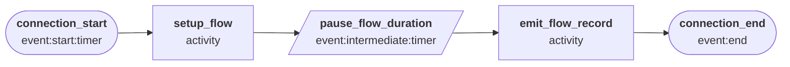
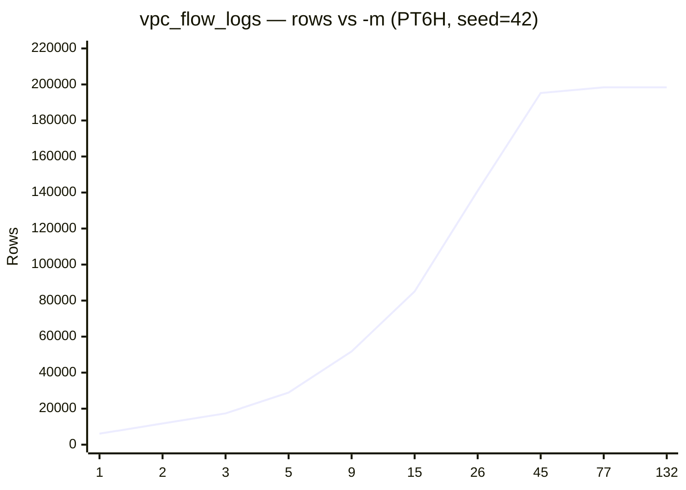

# VPC Flow Logs

Simulates AWS VPC Flow Log records for a mix of web and API traffic patterns.

Supports one template: `aws:cloudwatchlogs:vpcflow`

## Quick start

```bash
python generator.py -c presets/configs/vpc_flow_logs.json --template aws:cloudwatchlogs:vpcflow -n 500 -s "2025-01-01T00:00"

# One day of data
python generator.py -c presets/configs/vpc_flow_logs.json --template aws:cloudwatchlogs:vpcflow -r P1D -s "2025-01-01T00:00"
```

## Output fields

| Field | Description |
| --- | --- |
| `version` | Flow log version (always `2`) |
| `account_id` | AWS account ID |
| `interface_id` | Elastic network interface ID |
| `srcaddr` | Source IP address |
| `dstaddr` | Destination IP address |
| `srcport` | Source port |
| `dstport` | Destination port |
| `protocol` | IP protocol number (6=TCP, 17=UDP) |
| `packets` | Packet count for the flow |
| `bytes` | Byte count for the flow |
| `start` | Flow start time (Unix epoch) |
| `end` | Flow end time (Unix epoch) |
| `action` | `ACCEPT` or `REJECT` |
| `log_status` | `OK`, `NODATA`, or `SKIPDATA` |

## State machine

Each worker represents one network flow. The Actor captures connection attributes and a start timestamp, waits for the flow duration, then emits a single completed flow record.



## Concurrency (`-m`)

| Little's Law component | Value |
| --- | --- |
| Average session duration (W) | ~13 seconds |
| Interarrival mean | 0.5 s |
| Base arrival rate (λ = 1/mean) | ~2.0 connections/sec |
| Natural concurrency (L = λW) | ~66 |

Empirical measurements below (`--seed 42`, no schedule, PT6H simulated window) show rows scaling linearly with `-m` until the ceiling at ~66, then plateauing. The theoretical L = λW ≈ 25; the empirical ceiling is higher due to session-duration variance. To regenerate: `python tools/bench_config.py -c presets/configs/vpc_flow_logs.json --clock-field start`.

| `-m` | Rows (PT6H) | Wall-clock (s) |
| ---: | ---: | ---: |
| 1 | 6,116 | 0.5 |
| 2 | 11,771 | 0.9 |
| 3 | 17,362 | 1.2 |
| 5 | 28,940 | 1.9 |
| 9 | 51,778 | 3.3 |
| 15 | 85,101 | 5.4 |
| 26 | 140,958 | 8.9 |
| 45 | 195,269 | 12.4 |
| 77 | 198,392 | 12.5 |
| 132 | 198,392 | 12.6 |


