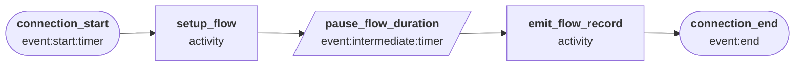
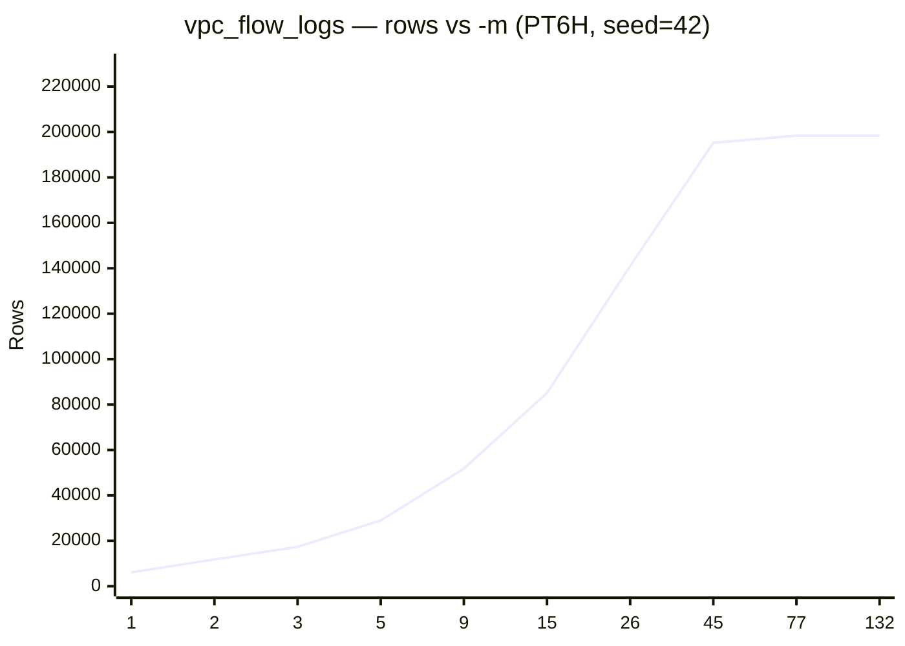

# VPC Flow Logs

Simulates AWS VPC Flow Log records for a mix of web and API traffic patterns.

## Quick start

```bash
python generator.py -c presets/configs/vpc_flow_logs.json --template aws:cloudwatchlogs:vpcflow -n 500 -s "2025-01-01T00:00"

# One day of data
python generator.py -c presets/configs/vpc_flow_logs.json --template aws:cloudwatchlogs:vpcflow -r P1D -s "2025-01-01T00:00"

# OCSF Network Activity (security data lake / SIEM ingestion)
python generator.py -c presets/configs/vpc_flow_logs.json --template ocsf:network_activity -r P1D -s "2025-01-01T00:00"
```

## Templates

| Template | Output |
| --- | --- |
| `aws:cloudwatchlogs:vpcflow` | AWS VPC Flow Log record (`aws:cloudwatchlogs:vpcflow` sourcetype) |
| `ocsf:network_activity` | [OCSF](https://schema.ocsf.io/) 1.4.0 Network Activity (`class_uid` 4001) JSON — one event per flow record, for security data lake / SIEM ingestion |

The `ocsf:network_activity` template treats each flow record as an OCSF `activity_id: 6` ("Traffic") report, since a VPC flow record already aggregates a connection's packets/bytes over an interval rather than representing a single open/close event — this mirrors AWS's own OCSF mapping guidance for VPC Flow Logs. `direction_id`/`boundary_id` are derived from whether `srcaddr`/`dstaddr` fall in the `10.0.0.0/16` internal range (external source → Inbound/External, both internal → Lateral/Internal); `status_id` follows `ACCEPT`/`REJECT`. Verified against the real OCSF 1.4.0 `network_activity` JSON Schema across 198K generated records (0 violations).

## Output fields

| Field | Description |
| --- | --- |
| `version` | Flow log version (always `2`) |
| `account_id` | AWS account ID |
| `interface_id` | Elastic network interface ID |
| `srcaddr` | Source IP address |
| `dstaddr` | Destination IP address |
| `srcport` | Source port |
| `dstport` | Destination port |
| `protocol` | IP protocol number (6=TCP, 17=UDP) |
| `packets` | Packet count for the flow |
| `bytes` | Byte count for the flow |
| `start` | Flow start time (Unix epoch) |
| `end` | Flow end time (Unix epoch) |
| `action` | `ACCEPT` or `REJECT` |
| `log_status` | `OK`, `NODATA`, or `SKIPDATA` |

## State machine

Each worker represents one network flow. The Actor captures connection attributes and a start timestamp, waits for the flow duration, then emits a single completed flow record.


```mermaid
flowchart LR
    A(["<b>connection_start</b><br/>event:start:timer"]) --> B["<b>setup_flow</b><br/>activity"]
    B --> C[/"<b>pause_flow_duration</b><br/>event:intermediate:timer"/]
    C --> D["<b>emit_flow_record</b><br/>activity"]
    D --> E(["<b>connection_end</b><br/>event:end"])
```

## Concurrency (`-m`)

The `-m` ceiling is ~66. Setting `-m` above this has no effect — the worker pool is never fully used.

The table below shows how output scales with `-m` (`--seed 42`, no schedule, PT6H simulated window). To regenerate: `python tools/bench_config.py -c presets/configs/vpc_flow_logs.json --clock-field start`.

| `-m` | Rows (PT6H) | Wall-clock (s) |
| ---: | ---: | ---: |
| 1 | 6,116 | 0.5 |
| 2 | 11,771 | 0.9 |
| 3 | 17,362 | 1.2 |
| 5 | 28,940 | 1.9 |
| 9 | 51,778 | 3.3 |
| 15 | 85,101 | 5.3 |
| 26 | 140,958 | 9.0 |
| 45 | 195,269 | 12.2 |
| 77 | 198,392 | 12.6 |
| 132 | 198,392 | 12.4 |


```mermaid
xychart-beta
    title "vpc_flow_logs — rows vs -m (PT6H, seed=42)"
    x-axis [1, 2, 3, 5, 9, 15, 26, 45, 77, 132]
    y-axis "Rows" 0 --> 230000
    line [6116, 11771, 17362, 28940, 51778, 85101, 140958, 195269, 198392, 198392]
```
