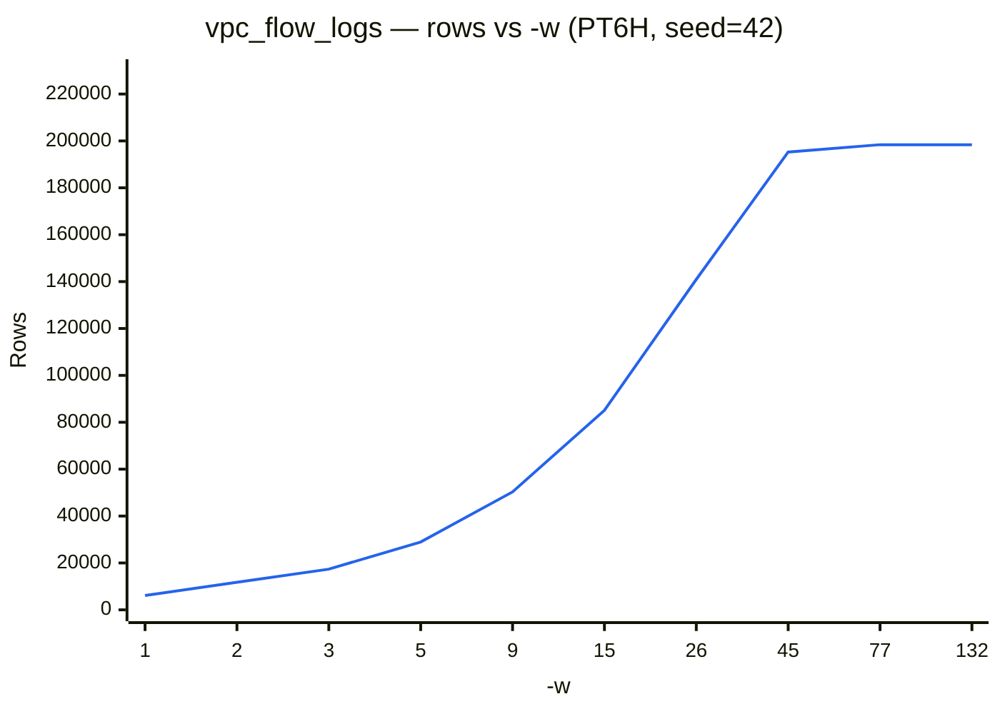

# VPC Flow Logs

Simulates AWS VPC Flow Log records for a mix of web and API traffic patterns.

## Quick start

```bash
python generator.py -c presets/configs/vpc_flow_logs.json --template \
  aws:cloudwatchlogs:vpcflow -n 500 -s "2025-01-01T00:00"

# One day of data
python generator.py -c presets/configs/vpc_flow_logs.json --template \
  aws:cloudwatchlogs:vpcflow -r P1D -s "2025-01-01T00:00"

# OCSF Network Activity (security data lake / SIEM ingestion)
python generator.py -c presets/configs/vpc_flow_logs.json --template \
  ocsf:network_activity -r P1D -s "2025-01-01T00:00"
```

## Templates

| Template | Output |
| --- | --- |
| `aws:cloudwatchlogs:vpcflow` | AWS VPC Flow Log record (`aws:cloudwatchlogs:vpcflow` sourcetype) |
| `ocsf:network_activity` | [OCSF](https://schema.ocsf.io/) 1.4.0 Network Activity (`class_uid` 4001) JSON — one event per flow record, for security data lake / SIEM ingestion |

The `ocsf:network_activity` template treats each flow record as an OCSF
`activity_id: 6` ("Traffic") report, since a VPC flow record already aggregates
a connection's packets/bytes over an interval rather than representing a single
open/close event — this mirrors AWS's own OCSF mapping guidance for VPC Flow
Logs. `direction_id`/`boundary_id` are derived from whether `srcaddr`/`dstaddr`
fall in the `10.0.0.0/16` internal range (external source → Inbound/External,
both internal → Lateral/Internal); `status_id` follows `ACCEPT`/`REJECT`.
Verified against the real OCSF 1.4.0 `network_activity` JSON Schema across 198K
generated records (0 violations).

## Output fields

| Field | Description |
| --- | --- |
| `version` | Flow log version (always `2`) |
| `account_id` | AWS account ID |
| `interface_id` | Elastic network interface ID |
| `srcaddr` | Source IP address |
| `dstaddr` | Destination IP address |
| `srcport` | Source port |
| `dstport` | Destination port |
| `protocol` | IP protocol number (6=TCP, 17=UDP) |
| `packets` | Packet count for the flow |
| `pkt_size` | Bytes per packet for the flow — a constant MSS per traffic class, so `packets * pkt_size` never exceeds a real path MTU |
| `bytes` | Byte count for the flow, computed as `packets * pkt_size` in each template. Not present in default (untemplated) JSON output, since that path has no way to compute a value from other fields — request `aws:cloudwatchlogs:vpcflow` or `ocsf:network_activity` if you need `bytes` directly |
| `start` | Flow start time (Unix epoch) |
| `end` | Flow end time (Unix epoch) |
| `action` | `ACCEPT` or `REJECT` |
| `log_status` | `OK`, `NODATA`, or `SKIPDATA` |

`bytes` is derived rather than sampled independently: an earlier version drew
`bytes` and `packets` from unrelated distributions, which could produce
physically impossible combinations (an implied bytes-per-packet ratio exceeding
a 1500-byte MTU). Deriving `bytes` from `packets * pkt_size` makes every row
physically consistent by construction.

## State machine

Each worker represents one network flow. The Actor captures connection
attributes and a start timestamp, waits for the flow duration, then emits a
single completed flow record.


```mermaid
flowchart LR
    A(["<b>connection_start</b><br/>event:start:timer"]) --> B["<b>setup_flow</b><br/>activity"]
    B --> C[/"<b>pause_flow_duration</b><br/>event:intermediate:timer"/]
    C --> D["<b>emit_flow_record</b><br/>activity"]
    D --> E(["<b>connection_end</b><br/>event:end"])
```

## Volume

The default start interval for workers in this preset is 0.5 seconds, with each
worker busy for 33 seconds on average. The maximum number of workers that can be
busy at the same time is therefore 33/0.5 = 66; increasing available workers
(using `-w`) without adjusting how often they begin work (using `-i`) has no
effect.

The chart below shows how output scales with workers (varying `-w`) with the
preset's default start interval (`--seed 42`, no schedule, PT6H simulated
window). To regenerate: `python tools/bench_config_workers.py -c
presets/configs/vpc_flow_logs.json --clock-field start`.


```mermaid
%%{init: {'themeVariables': {'xyChart': {'plotColorPalette': '#2563eb'}}}}%%
xychart-beta
    title "vpc_flow_logs — rows vs -w (PT6H, seed=42)"
    x-axis "-w" [1, 2, 3, 5, 9, 15, 26, 45, 77, 132]
    y-axis "Rows" 0 --> 230000
    line [6116, 11771, 17362, 28940, 50317, 85101, 140958, 195269, 198392, 198392]
```

Adjust `-i` and `-w` to model heavier network traffic. The table below
illustrates how output scales across `-w` and `-i` together (`--seed 42`, no
schedule, PT6H simulated window). To regenerate: `python tools/bench_grid.py -c
presets/configs/vpc_flow_logs.json`.

| `-i` \ `-w` | 1 | 5 | 25 | 100 | 250 | 1,000 | 2,500 | 5,000 |
| :--- | :--- | :--- | :--- | :--- | :--- | :--- | :--- | :--- |
| 0.01 | ↕️ | ↕️ | 🟨 166,762 (8.2s) | 🟧 666,752 (24.4s) | 🟥 1,671,340 (56.3s) | 🟥 6,683,523 (222.6s) | 🟥 9,923,637 (338.9s) | ↔️ |
| 0.1 | 🟩 7,152 (0.7s) | 🟩 32,789 (1.5s) | 🟨 164,680 (5.5s) | 🟧 658,986 (20.4s) | 🟧 996,499 (30.7s) | ↔️ | ↔️ | ↔️ |
| 0.5 (default) | 🟩 6,807 (0.5s) | 🟩 32,061 (1.2s) | 🟨 150,766 (4.7s) | 🟨 199,652 (6.2s) | ↔️ | ↔️ | ↔️ | ↔️ |
| 1 | 🟩 6,624 (0.4s) | 🟩 31,192 (1.1s) | 🟨 99,033 (3.1s) | 🟨 99,971 (3.2s) | ↔️ | ↔️ | ↔️ | ↔️ |

💥 = Crashed. ⏱️ = Timeout. ↔️ = Plateau -- increasing -w had
no effect. ↕️ = Plateau -- decreasing -i had no effect. (Ns) = wall-clock
seconds for that cell's own run -- not shown for skipped/plateau cells, which
were never actually run.
