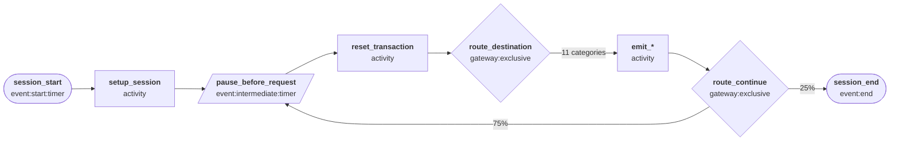
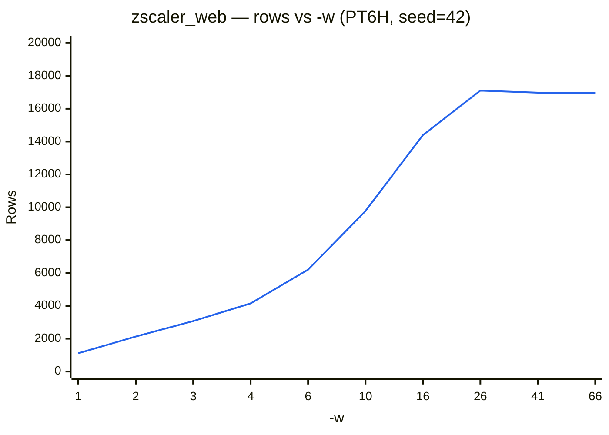

# Zscaler Web (NSS-WEB)

Simulates Zscaler Internet Access (ZIA) web/proxy log records for an employee's browsing session — one record per page or request the proxy observed, categorized, security-scanned, and allowed or blocked.

## Quick start

```bash
python generator.py -c presets/configs/zscaler_web.json --template zscalernss-web -n 500 -s "2025-01-01T00:00"

# One day of data
python generator.py -c presets/configs/zscaler_web.json --template zscalernss-web -r P1D -s "2025-01-01T00:00"

# OCSF HTTP Activity (security data lake / SIEM ingestion)
python generator.py -c presets/configs/zscaler_web.json --template ocsf:http_activity -r P1D -s "2025-01-01T00:00"
```

## Templates

| Template | Output |
| --- | --- |
| `zscalernss-web` | Authentic Zscaler NSS feed wire format — tab-delimited `key=value` pairs, matching the `zscalernss-web` Splunk sourcetype |
| `ocsf:http_activity` | [OCSF](https://schema.ocsf.io/) 1.4.0 HTTP Activity (`class_uid` 4002) JSON — one event per transaction, for security data lake / SIEM ingestion |

The `ocsf:http_activity` template derives `activity_id`/`type_uid` from `requestmethod`; `status_id`/`severity_id` follow `action` (`Allowed` → success/informational, `Blocked` → failure, escalated to high severity when `threatcategory` is set and medium otherwise). `urlcategory`/`urlsupercategory`/`urlclass` populate the HTTP request URL's `categories` array; fields with no clean OCSF slot (department, threat/DLP detail, `bwthrottle`, etc.) go in `unmapped`. Verified against the real OCSF 1.4.0 `http_activity` JSON Schema across 17K generated records (0 violations).

## Output fields

| Field | Description |
| --- | --- |
| `datetime` | Transaction timestamp |
| `ClientIP` | Internal client IP address |
| `action` | `Allowed` or `Blocked` |
| `appclass` | Broad application classification |
| `appname` | Recognized application name |
| `bwthrottle` | `YES` if bandwidth-throttled by policy, else `NO` |
| `clientpublicIP` | Public (egress/NAT) IP address the request left the corporate network from |
| `clienttranstime` | Client-side transaction time (ms) |
| `contenttype` | Response content type |
| `department` | Employee's department |
| `devicehostname` | Client device hostname |
| `deviceowner` | Display name of the device owner |
| `dlpdictionaries` | DLP dictionary that matched, or `None` |
| `dlpengine` | DLP engine that fired, or `None` |
| `fileclass` | Broad file classification, or `-` |
| `filename` | Downloaded/uploaded filename, or `-` |
| `filetype` | File type, or `-` |
| `hostname` | Destination hostname |
| `location` | Employee's office/site |
| `md5` | MD5 hash of the file involved, or `-` |
| `pagerisk` | Zscaler page risk score (0-100) |
| `protocol` | `HTTPS` or `HTTP` |
| `reason` | Policy reason for the `action` taken |
| `refererURL` | HTTP referrer, or `-` |
| `requestmethod` | HTTP method |
| `requestsize` | Request size (bytes) |
| `responsesize` | Response size (bytes) |
| `serverip` | Destination server IP address |
| `servertranstime` | Server-side transaction time (ms) |
| `status` | HTTP status code |
| `threatcategory` | Threat category, or `None` |
| `threatclass` | Threat classification, or `None` |
| `threatname` | Matched threat signature name, or `None` |
| `transactionsize` | Total transaction size (bytes) |
| `unscannabletype` | Reason content could not be scanned, or `None` |
| `url` | Request path |
| `urlcategory` | Zscaler URL category |
| `urlclass` | Broad URL classification |
| `urlsupercategory` | Zscaler URL super-category |
| `user` | Employee's login/username |
| `useragent` | Browser user-agent string |

## Destination categories

Each transaction is routed to one of eleven destination profiles, each with its own correlated hostname, category, and security fields:

| Category | Share of traffic | Behavior |
| --- | --- | --- |
| Microsoft 365 | 20% | Allowed, business productivity |
| Salesforce | 7% | Allowed, business productivity |
| Slack | 6% | Allowed, business productivity |
| Search engines | 12% | Allowed |
| News and reference | 8% | Allowed |
| Social networking | 10% | Allowed, monitored |
| Streaming media | 8% | Allowed, occasionally bandwidth-throttled |
| Cloud file storage | 8% | Allowed |
| Cloud file storage (DLP) | 2% | Blocked — outbound DLP policy violation |
| Uncategorized browsing | 14% | Allowed, long-tail of mostly-unique destinations |
| Malicious/phishing | 5% | Blocked — threat detected |

## State machine

Each worker represents one browsing session. The Actor sets session-constant attributes (user, device, location), then loops through a variable number of transactions — dwelling between each — before ending the session.



## Volume

The default start interval for workers in this preset is 5 seconds, with each worker busy for 165 seconds on average. The maximum number of workers that can be busy at the same time is therefore 165/5 = 33; increasing available workers (using `-w`) without adjusting how often they begin work (using `-i`) has no effect.

The chart below shows how output scales with workers (varying `-w`) with the preset's default start interval (`--seed 42`, no schedule, PT6H simulated window). To regenerate: `python tools/bench_config_workers.py -c presets/configs/zscaler_web.json`.



Adjust `-i` and `-w` to model heavier corporate web traffic. The table below illustrates how output scales across `-w` and `-i` together (`--seed 42`, no schedule, PT6H simulated window). To regenerate: `python tools/bench_grid.py -c presets/configs/zscaler_web.json`.

| `-i` \ `-w` | 1 | 5 | 25 | 100 | 250 | 1,000 | 2,500 | 5,000 |
| :--- | :--- | :--- | :--- | :--- | :--- | :--- | :--- | :--- |
| 0.01 | ↕️ | ↕️ | 🟨 26,853 (4.3s) | 🟧 108,328 (8.8s) | 🟧 270,783 (17.5s) | 🟥 1,078,757 (61.6s) | 🟥 2,696,713 (157.8s) | 🟥 5,393,146 (314.2s) |
| 0.1 | 🟩 1,065 (0.5s) | ↕️ | 🟨 26,896 (2.3s) | 🟧 107,837 (7.6s) | 🟧 269,433 (18.7s) | 🟥 863,273 (59.6s) | ↔️ | ↔️ |
| 1 | 🟩 1,062 (0.3s) | 🟩 5,363 (0.6s) | 🟨 26,562 (2.0s) | 🟧 85,611 (5.8s) | 🟧 86,572 (5.9s) | ↔️ | ↔️ | ↔️ |
| 5 (default) | 🟩 996 (0.3s) | 🟩 4,986 (0.5s) | 🟨 17,084 (1.3s) | 🟨 16,905 (1.3s) | ↔️ | ↔️ | ↔️ | ↔️ |

💥 = thread-creation limit hit. ⏱️ = Timeout. ↔️ = Plateau -- increasing -w had no effect. ↕️ = Plateau -- decreasing -i had no effect. (Ns) = wall-clock seconds for that cell's own run -- not shown for skipped/plateau cells, which were never actually run.
