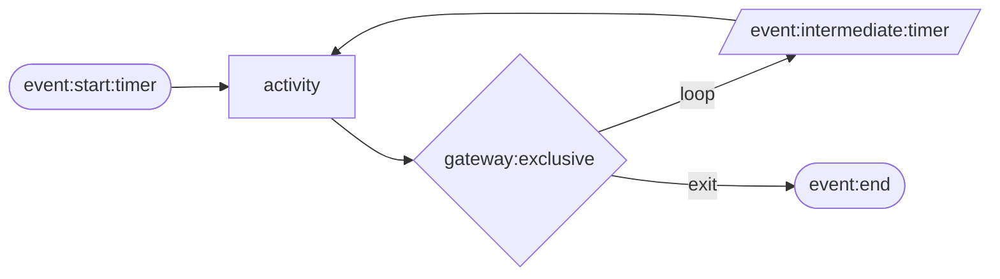

# Worker states

> Building a new config? See [How to build a config](./how-to-build-a-config.md) for the design process. This page is the state type index — follow the links for per-type field references.

## The Actor

The state machine design is grounded in [BPMN (Business Process Model and Notation)](https://en.wikipedia.org/wiki/Business_Process_Model_and_Notation) — a standard for modelling business processes as flows of events, activities, and gateways. The five state types map directly onto BPMN concepts: start/intermediate/end events, activities, and exclusive gateways. Each worker is a BPMN pool — one lane, one participant, one lifecycle.

Every state machine models the behaviour of a single **Actor** — the real-world entity whose lifecycle the state machine represents. Each concurrent worker (`-m`) runs one independent instance of the machine, simulating one Actor at a time.

Identifying the Actor upfront is the most important design decision for a new config. It determines what counts as one lifecycle, what variables are set once at entry and carried through, and which state is the `event:end`.

| Config | Actor |
| --- | --- |
| `ecommerce_lighting` | A visitor browsing the website |
| `vpc_flow_logs` | A network connection |
| `ssh_auth` | A remote client opening an SSH connection |
| `pbx_calls` | A caller making a phone call |
| `endpoint_network` | A connection attempt arriving at or leaving a Windows host |

A typical Actor lifecycle looks like this:

---

## State types

There are seven state types. Every state must have a `name` and a `type`.

| Type | Role | Emits a record? | Sets variables? | Delays? |
| --- | --- | --- | --- | --- |
| [`event:start:timer`](./states/event-start-timer.md) | First state; controls interarrival pacing | No | No | Yes — `cardinality_distribution` |
| [`event:start:message`](./states/event-start-message.md) | Subprocess entry point; receives variables from the parent | No | Optional | No |
| [`event:intermediate:timer`](./states/event-intermediate-timer.md) | Pause between activities | No | No | Yes — `cardinality_distribution` |
| [`activity`](./states/activity.md) | Do work: set variables and/or emit a record | Optional | Optional | No |
| [`gateway:exclusive`](./states/gateway-exclusive.md) | Probabilistic routing | No | No | No |
| [`subprocess:multi:variables`](./states/subprocess-multi-variables.md) | FOR-EACH loop — run a child config once per item in `items` | No (child emits) | No | No |
| [`event:end`](./states/event-end.md) | Terminate the worker | No | No | No |

List all states in the `states` array of the configuration file. The first entry is the initial state and must be of type `event:start:timer`.

---

## Variable namespace

Each worker carries a **variable namespace** — a dict that persists for the entire lifecycle, from the first state to `event:end`. Everything that writes to or reads from this dict is part of the namespace system.

**Writing to the namespace:**

- [`generator:*` dimensions](./dimensions/generator.md) — an activity state's `variables` block samples values using `generator:*` types and writes them into the namespace at runtime.
- [`subprocess:multi:variables`](./states/subprocess-multi-variables.md) — each item's variable specs are evaluated and written into the namespace before the child run starts.

**Reading from the namespace:**

- `"type": "variable"` in an emitter `dimensions` list looks up a key at emit time and writes its value into the output record.

**Lifetime rules:**

- Keys persist for the entire lifecycle — once written, a value is available in every subsequent state.
- Revisiting a state unconditionally **overwrites** the key's current value. There is no accumulation or append semantics.
- When a worker reaches `event:end` and begins a new lifecycle, the namespace is reset to empty.

This means session-level values written once in a `setup_*` activity naturally persist across all subsequent emit states without being redeclared.

---

## Startup validation

Running with `--validate` checks the config before any data is generated. It catches:

- Missing `event:start:timer` or `event:end` state
- Invalid state types or missing required fields
- Transition targets that don't exist
- Gateway probabilities that don't sum to 1.0 (±0.01 tolerance)
- Emitter dimensions referencing a variable that is never set by any activity
- Named template not found in the config (when `-t` is specified)
- Environment variables referenced in a template that are not set

It does **not** catch ordering issues — a variable referenced in an emitter might pass validation even if the execution path reaches the emitter before the variable is set. That will raise a runtime error. Test with `-n 100 -s "2024-01-01T00:00:00"` to surface these.

---

## See also

- [How to build a config](how-to-build-a-config.md) — step-by-step design guide
- [Generator types](dimensions/generator.md) — `generator:*` types for use in `variables` blocks and `emitter.dimensions`
- [Distributions](distributions.md) — distribution types for `cardinality_distribution`
- [Emitters](emitters.md) — emitter structure and dimension fields
- [Common patterns](patterns.md) — variable persistence, multi-record sessions, flow duration
- [Best practices](best-practices.md) — naming conventions and pitfalls
