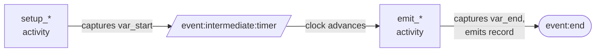
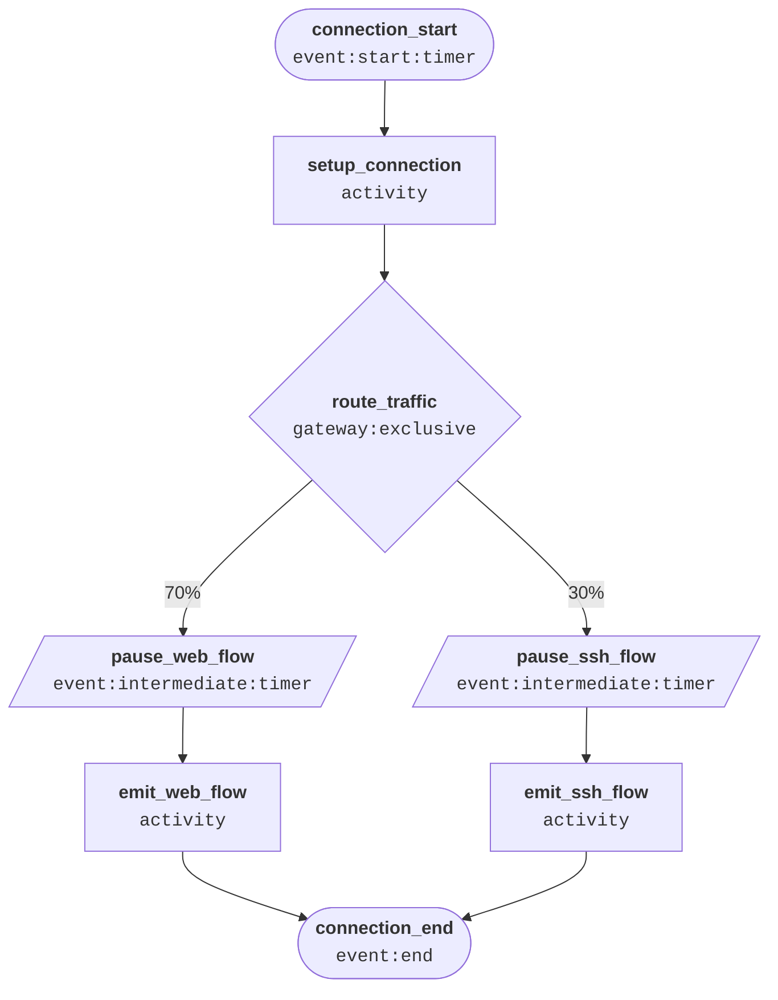

# Worker states

> Building a new config? See [How to build a config](./how-to-build-a-config.md) for the design process. This page is the state type field reference.

## The Actor

The state machine design is grounded in [BPMN (Business Process Model and Notation)](https://en.wikipedia.org/wiki/Business_Process_Model_and_Notation) — a standard for modelling business processes as flows of events, activities, and gateways. The five state types map directly onto BPMN concepts: start/intermediate/end events, activities, and exclusive gateways. Each worker is a BPMN pool — one lane, one participant, one lifecycle.

Every state machine models the behaviour of a single **Actor** — the real-world entity whose lifecycle the state machine represents. Each concurrent worker (`-m`) runs one independent instance of the machine, simulating one Actor at a time.

Identifying the Actor upfront is the most important design decision for a new config. It determines what counts as one lifecycle, what variables are set once at entry and carried through, and which state is the `event:end`.

| Config | Actor |
| --- | --- |
| `ecommerce_lighting` | A visitor browsing the website |
| `vpc_flow_logs` | A network connection |
| `ssh_auth` | A remote client opening an SSH connection |
| `pbx_calls` | A caller making a phone call |
| `endpoint_network` | A connection attempt arriving at or leaving a Windows host |

A typical Actor lifecycle looks like this:


---

## State types

There are five state types. Every state must have a `name` and a `type`.

| Type | Role | Emits a record? | Sets variables? | Delays? |
| --- | --- | --- | --- | --- |
| `event:start:timer` | First state; controls interarrival pacing | No | No | Yes — `cardinality_distribution` |
| `event:intermediate:timer` | Pause between activities | No | No | Yes — `cardinality_distribution` |
| `activity` | Do work: set variables and/or emit a record | Optional | Optional | No |
| `gateway:exclusive` | Probabilistic routing | No | No | No |
| `event:end` | Terminate the worker | No | No | No |

List all states in the `states` array of the configuration file. The first entry is the initial state and must be of type `event:start:timer`.

---

## event:start:timer

The first state in every config. Its sole job is to control how fast new workers are spawned (the interarrival interval). It does not emit a record and cannot set variables.

| Field | Description | Required? |
| --- | --- | --- |
| `name` | Unique name for this state. | Yes |
| `type` | Must be `"event:start:timer"`. | Yes |
| `_comment` | Optional annotation. | No |
| `cardinality_distribution` | How long (in seconds) to wait before the worker proceeds. A [`distribution`](./distributions.md) object. | Yes |
| `next` | Name of the next state (a string, not a transitions list). | Yes |

```json
{
  "name": "session_start",
  "type": "event:start:timer",
  "_comment": "New sessions arrive every ~1 second on average",
  "cardinality_distribution": {
    "type": "exponential",
    "mean": 1.0
  },
  "next": "setup_session"
}
```

---

## event:intermediate:timer

A pause between two activities. Use this whenever you need the simulated clock to advance before the next activity runs — for example, to model the duration of a network flow, a page dwell time, or a processing delay. It does not emit a record and cannot set variables.

| Field | Description | Required? |
| --- | --- | --- |
| `name` | Unique name for this state. | Yes |
| `type` | Must be `"event:intermediate:timer"`. | Yes |
| `_comment` | Optional annotation. | No |
| `cardinality_distribution` | How long (in seconds) to delay. A [`distribution`](./distributions.md) object. | Yes |
| `next` | Name of the next state (a string, not a transitions list). | Yes |

```json
{
  "name": "pause_flow_duration",
  "type": "event:intermediate:timer",
  "_comment": "Flow lasts 5–30 seconds",
  "cardinality_distribution": {
    "type": "uniform",
    "min": 5.0,
    "max": 30.0
  },
  "next": "emit_flow_record"
}
```

---

## activity

An activity is where work happens: variables are evaluated and, optionally, a record is emitted. There is no delay in an activity state — use an `event:intermediate:timer` immediately before the activity if you need the clock to advance first.

**Execution order** within an activity state:

1. `variables` are evaluated (if present).
2. If an `emitter` is specified, a record is emitted using the current variable values.
3. The `next` state is selected.

| Field | Description | Required? |
| --- | --- | --- |
| `name` | Unique name for this state. | Yes |
| `type` | Must be `"activity"`. | Yes |
| `_comment` | Optional annotation. | No |
| `variables` | A list of [field generators](./field-generators.md) whose values are stored for later use. Evaluated before the record is emitted. | No |
| `emitter` | The [emitter](./emitters.md) to use. If omitted, no record is emitted. | No |
| `next` | Name of the next state (a string, not a transitions list). Route to an `event:end` state to terminate. | Yes |

### Naming conventions

By convention:

- Activity states that **only set variables** (no emitter) are named `setup_*`.
- Activity states that **emit records** (with or without also setting variables) are named `emit_*`.

There is no type distinction between these two patterns — both use `"type": "activity"`. The naming convention exists purely to make configs easier to read.

### Example: setup activity

```json
{
  "name": "setup_session",
  "type": "activity",
  "_comment": "Capture session-level variables before routing",
  "variables": [
    {
      "name": "var_user_id",
      "type": "int",
      "cardinality": 0,
      "distribution": { "type": "uniform", "min": 1, "max": 10000 }
    },
    {
      "name": "var_start",
      "type": "clock"
    }
  ],
  "next": "route_session"
}
```

### Example: emit activity

```json
{
  "name": "emit_flow_record",
  "type": "activity",
  "_comment": "Capture end time and stats, then emit the completed flow record",
  "variables": [
    { "name": "var_end", "type": "clock" },
    {
      "name": "var_bytes",
      "type": "int",
      "cardinality": 0,
      "distribution": { "type": "uniform", "min": 500, "max": 50000 }
    }
  ],
  "emitter": "flow_log",
  "next": "session_end"
}
```

### Modeling events with duration

To emit a record that covers a time range (e.g. a network flow with `start` and `end` timestamps), use the **setup → timer → emit** pattern:



1. A `setup_*` activity captures `var_start` via a `clock` field generator.
2. An `event:intermediate:timer` advances the clock by the flow duration.
3. An `emit_*` activity captures `var_end` and emits the record.

```json
[
  {
    "name": "setup_web_flow",
    "type": "activity",
    "_comment": "Capture start time and connection attributes before the flow runs",
    "variables": [
      { "name": "var_start", "type": "clock" },
      {
        "name": "var_dstport",
        "type": "enum",
        "values": [80, 443],
        "cardinality_distribution": { "type": "uniform", "min": 0, "max": 1 }
      }
    ],
    "next": "pause_web_flow"
  },
  {
    "name": "pause_web_flow",
    "type": "event:intermediate:timer",
    "_comment": "Flow lasts 5–30 seconds",
    "cardinality_distribution": { "type": "uniform", "min": 5.0, "max": 30.0 },
    "next": "emit_web_flow"
  },
  {
    "name": "emit_web_flow",
    "type": "activity",
    "_comment": "Capture end time and packet stats, then emit the flow record",
    "variables": [
      { "name": "var_end", "type": "clock" },
      {
        "name": "var_packets",
        "type": "int",
        "cardinality": 0,
        "distribution": { "type": "uniform", "min": 50, "max": 500 }
      }
    ],
    "emitter": "vpc_flow_log",
    "next": "session_end"
  }
]
```

**Result**: `var_start` is captured at state entry, then 5–30 seconds pass, then `var_end` is captured. The emitted record has `start < end` with realistic duration.

---

## gateway:exclusive

Routes the worker to one of several next states based on weighted probabilities. It does not emit a record and cannot set variables. Use this to model branching paths — e.g., 40% web traffic, 25% database traffic, etc.

| Field | Description | Required? |
| --- | --- | --- |
| `name` | Unique name for this state. | Yes |
| `type` | Must be `"gateway:exclusive"`. | Yes |
| `_comment` | Optional annotation. | No |
| `transitions` | A list of possible next states and their probabilities. | Yes |

### transitions

| Field | Description | Required? |
| --- | --- | --- |
| `next` | The name of the next state. Route to an `event:end` state to terminate. | Yes |
| `probability` | Probability of this branch being taken. All probabilities must sum to 1.0. | Yes |

```json
{
  "name": "route_traffic",
  "type": "gateway:exclusive",
  "_comment": "Route to traffic type based on realistic distribution",
  "transitions": [
    { "next": "setup_web_traffic", "probability": 0.4 },
    { "next": "setup_database_traffic", "probability": 0.25 },
    { "next": "setup_ssh_traffic", "probability": 0.1 },
    { "next": "setup_internal_api", "probability": 0.2 },
    { "next": "setup_port_scan", "probability": 0.05 }
  ]
}
```

---

## event:end

Terminates the worker. No fields other than `name` and `type` are permitted. The worker thread exits cleanly after reaching this state.

| Field | Description | Required? |
| --- | --- | --- |
| `name` | Unique name for this state. | Yes |
| `type` | Must be `"event:end"`. | Yes |

```json
{
  "name": "session_end",
  "type": "event:end"
}
```

Every config should have exactly one `event:end` state. All paths through the state machine must eventually route to it.

---

## Complete example

This example models a simple network connection: a start timer controls interarrival, an activity sets up connection attributes and captures the start time, a timer delays for the flow duration, an activity emits the completed flow record, and an end state terminates the worker.



```json
{
  "states": [
    {
      "name": "connection_start",
      "type": "event:start:timer",
      "_comment": "New connections every ~1 second on average",
      "cardinality_distribution": { "type": "exponential", "mean": 1.0 },
      "next": "setup_connection"
    },
    {
      "name": "setup_connection",
      "type": "activity",
      "_comment": "Capture connection attributes and start timestamp",
      "variables": [
        { "name": "var_start", "type": "clock" },
        {
          "name": "var_srcport",
          "type": "int",
          "cardinality": 0,
          "distribution": { "type": "uniform", "min": 49152, "max": 65535 }
        }
      ],
      "next": "route_traffic"
    },
    {
      "name": "route_traffic",
      "type": "gateway:exclusive",
      "transitions": [
        { "next": "pause_web_flow", "probability": 0.7 },
        { "next": "pause_ssh_flow", "probability": 0.3 }
      ]
    },
    {
      "name": "pause_web_flow",
      "type": "event:intermediate:timer",
      "_comment": "Web flows last 5–30 seconds",
      "cardinality_distribution": { "type": "uniform", "min": 5.0, "max": 30.0 },
      "next": "emit_web_flow"
    },
    {
      "name": "emit_web_flow",
      "type": "activity",
      "_comment": "Emit the completed web flow record",
      "variables": [
        { "name": "var_end", "type": "clock" }
      ],
      "emitter": "flow_record",
      "next": "connection_end"
    },
    {
      "name": "pause_ssh_flow",
      "type": "event:intermediate:timer",
      "_comment": "SSH sessions last 30–300 seconds",
      "cardinality_distribution": { "type": "uniform", "min": 30.0, "max": 300.0 },
      "next": "emit_ssh_flow"
    },
    {
      "name": "emit_ssh_flow",
      "type": "activity",
      "_comment": "Emit the completed SSH flow record",
      "variables": [
        { "name": "var_end", "type": "clock" }
      ],
      "emitter": "flow_record",
      "next": "connection_end"
    },
    {
      "name": "connection_end",
      "type": "event:end"
    }
  ],
  "emitters": [
    {
      "name": "flow_record",
      "dimensions": [
        { "name": "srcport", "type": "variable", "variable": "var_srcport" },
        { "name": "start", "type": "variable", "variable": "var_start" },
        { "name": "end", "type": "variable", "variable": "var_end" }
      ]
    }
  ]
}
```

---

## See Also

- [How to build a config](how-to-build-a-config.md) — step-by-step design guide
- [Field generators](field-generators.md) — all field generator types for use in `variables`
- [Distributions](distributions.md) — distribution types for `cardinality_distribution`
- [Common patterns](patterns.md) — variable persistence, multi-record sessions, flow duration
- [Best practices](best-practices.md) — naming conventions and pitfalls
