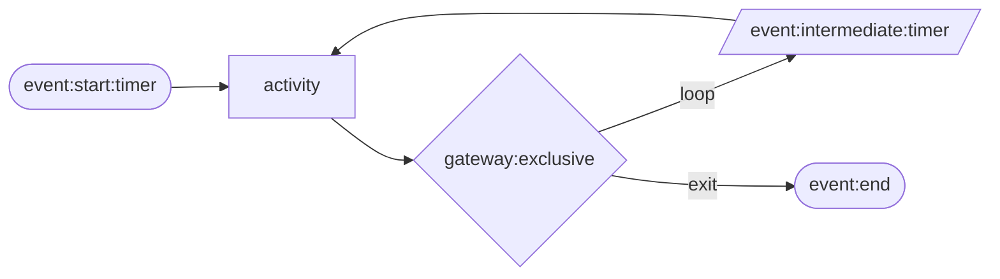
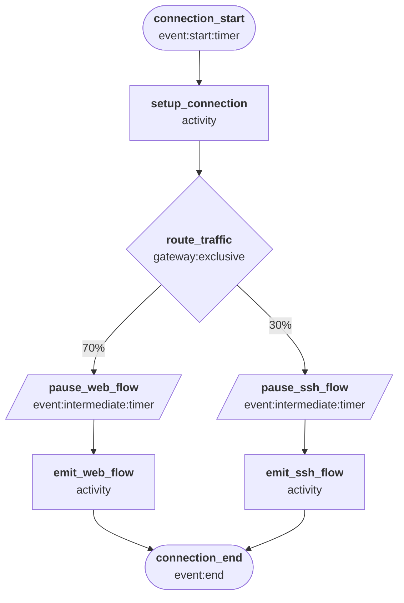

# Worker states

> Building a new config? See [How to build a config](./how-to-build-a-config.md)
> for the design process. This page is the state type field reference.

## The Actor

The state machine design is grounded in
[BPMN (Business Process Model and Notation)](https://en.wikipedia.org/wiki/Business_Process_Model_and_Notation)—a
standard for modelling business processes as flows of events, activities, and
gateways. The five state types map directly onto BPMN concepts:
start/intermediate/end events, activities, and exclusive gateways. Each worker
is a BPMN pool—one lane, one participant, one lifecycle.

Every state machine models the behaviour of a single **Actor**—the real-world
entity whose lifecycle the state machine represents. Each concurrent worker
(`-w`) runs one independent instance of the machine, simulating one Actor at a
time.

Identifying the Actor upfront is the most important design decision for a new
config. It determines what counts as one lifecycle, what variables are set once
at entry and carried through, and which state is the `event:end`.

| Config               | Actor                                                      |
| -------------------- | ---------------------------------------------------------- |
| `ecommerce_lighting` | A visitor browsing the website                             |
| `vpc_flow_logs`      | A network connection                                       |
| `ssh_auth`           | A remote client opening an SSH connection                  |
| `pbx_calls`          | A caller making a phone call                               |
| `endpoint_network`   | A connection attempt arriving at or leaving a Windows host |

A typical Actor lifecycle looks like this:


```mermaid
flowchart LR
    A([event:start:timer]) --> B[activity]
    B --> C{gateway:exclusive}
    C -->|loop| D[/event:intermediate:timer/]
    D --> B
    C -->|exit| E([event:end])
```

---

## State types

There are five state types. Every state must have a `name` and a `type`.

| Type                                                               | Role                                        | Emits a record? | Sets variables? | Delays?                                                                |
| ------------------------------------------------------------------ | ------------------------------------------- | --------------- | --------------- | ---------------------------------------------------------------------- |
| [`event:start:timer`](./states/event-start-timer.md)               | First state; controls interarrival pacing   | No              | No              | No—its `cardinality_distribution` sets the time between session starts |
| [`event:intermediate:timer`](./states/event-intermediate-timer.md) | Pause between activities                    | No              | No              | Yes—`cardinality_distribution`                                         |
| [`activity`](./states/activity.md)                                 | Do work: set variables and/or emit a record | Optional        | Optional        | No                                                                     |
| [`gateway:exclusive`](./states/gateway-exclusive.md)               | Probabilistic routing                       | No              | No              | No                                                                     |
| [`event:end`](./states/event-end.md)                               | End the session                             | No              | No              | No                                                                     |

List all states in the `states` array of the configuration file. The first entry
is the initial state and must be of type `event:start:timer`.

---

## Complete example

This example models a network connection: a start timer controls interarrival,
an activity sets up connection attributes and captures the start time, a timer
delays for the flow duration, an activity emits the completed flow record, and
an end state terminates the worker.


```mermaid
flowchart TD
    A(["<b>connection_start</b><br/>event:start:timer"]) --> B["<b>setup_connection</b><br/>activity"]
    B --> C{"<b>route_traffic</b><br/>gateway:exclusive"}
    C -->|70%| D[/"<b>pause_web_flow</b><br/>event:intermediate:timer"/]
    C -->|30%| E[/"<b>pause_ssh_flow</b><br/>event:intermediate:timer"/]
    D --> F["<b>emit_web_flow</b><br/>activity"]
    E --> G["<b>emit_ssh_flow</b><br/>activity"]
    F --> H(["<b>connection_end</b><br/>event:end"])
    G --> H
```

```json
{
  "states": [
    {
      "name": "connection_start",
      "type": "event:start:timer",
      "_comment": "New connections every ~1 second on average",
      "cardinality_distribution": { "type": "exponential", "mean": 1.0 },
      "next": "setup_connection"
    },
    {
      "name": "setup_connection",
      "type": "activity",
      "_comment": "Capture connection attributes and start timestamp",
      "variables": [
        { "name": "var_start", "type": "generator:clock" },
        {
          "name": "var_srcport",
          "type": "generator:int",
          "cardinality": 0,
          "distribution": { "type": "uniform", "min": 49152, "max": 65535 }
        }
      ],
      "next": "route_traffic"
    },
    {
      "name": "route_traffic",
      "type": "gateway:exclusive",
      "transitions": [
        { "next": "pause_web_flow", "probability": 0.7 },
        { "next": "pause_ssh_flow", "probability": 0.3 }
      ]
    },
    {
      "name": "pause_web_flow",
      "type": "event:intermediate:timer",
      "_comment": "Web flows last 5–30 seconds",
      "cardinality_distribution": { "type": "uniform", "min": 5.0, "max": 30.0 },
      "next": "emit_web_flow"
    },
    {
      "name": "emit_web_flow",
      "type": "activity",
      "_comment": "Emit the completed web flow record",
      "variables": [
        { "name": "var_end", "type": "generator:clock" }
      ],
      "emitter": "flow_record",
      "next": "connection_end"
    },
    {
      "name": "pause_ssh_flow",
      "type": "event:intermediate:timer",
      "_comment": "SSH sessions last 30–300 seconds",
      "cardinality_distribution": { "type": "uniform", "min": 30.0, "max": 300.0 },
      "next": "emit_ssh_flow"
    },
    {
      "name": "emit_ssh_flow",
      "type": "activity",
      "_comment": "Emit the completed SSH flow record",
      "variables": [
        { "name": "var_end", "type": "generator:clock" }
      ],
      "emitter": "flow_record",
      "next": "connection_end"
    },
    {
      "name": "connection_end",
      "type": "event:end"
    }
  ],
  "emitters": [
    {
      "name": "flow_record",
      "dimensions": [
        { "name": "srcport", "type": "variable", "variable": "var_srcport" },
        { "name": "start", "type": "variable", "variable": "var_start" },
        { "name": "end", "type": "variable", "variable": "var_end" }
      ]
    }
  ]
}
```

---

## Variable scope

Variables set in `activity` states are **per-worker and per-lifecycle**:

- Each worker starts with an empty variable namespace.
- Variables persist for the entire lifetime of that worker—once set, a variable
  is available in every subsequent activity state in the same lifecycle.
- Revisiting a state unconditionally **overwrites** the variable's previous
  value. There is no accumulation or append semantics.
- When the worker reaches `event:end` and a new lifecycle begins, the namespace
  is reset to empty.

This means session-level variables (set once in a `setup_*` activity at the
start) naturally persist across all subsequent emit states without being
redeclared.

---

## Startup validation

Running with `--validate` checks the config before any data is generated. It
catches:

- Missing `event:start:timer` or `event:end` state
- Unknown state types or missing required fields
- Transition targets that don't exist
- Gateway probabilities that don't sum to 1.0 (±0.01 tolerance)
- Emitter dimensions referencing a variable that is never set by any activity
- Named template not found in the config (when `-t` is specified)
- Environment variables referenced in a template that are not set

It does **not** catch ordering issues—a variable referenced in an emitter might
pass validation even if the execution path reaches the emitter before the
variable is set. That raises a runtime error. Test with
`-n 100 -s "2024-01-01T00:00:00"` to surface these.

---

## See also

- [How to build a config](how-to-build-a-config.md)—step-by-step design guide
- [Generators](dimensions/generator.md)—all generator types for use in
  `variables`
- [Distributions](distributions.md)—distribution types for
  `cardinality_distribution`
- [Common patterns](patterns.md)—variable persistence, multi-record sessions,
  flow duration
- [Best practices](best-practices.md)—naming conventions and pitfalls
