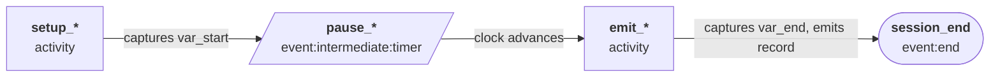

# `activity`

An activity is where work happens: variables are evaluated and, optionally, a
record is emitted. There is no delay in an activity state—use an
`event:intermediate:timer` immediately before the activity if you need the clock
to advance first.

**Execution order** within an activity state:

1. `variables` are evaluated (if present).
2. If an `emitter` is specified, a record is emitted using the current variable
   values.
3. The `next` state is selected.

| Field       | Description                                                                                                                                                                       | Required? |
| ----------- | --------------------------------------------------------------------------------------------------------------------------------------------------------------------------------- | --------- |
| `name`      | Unique name for this state.                                                                                                                                                       | Yes       |
| `type`      | Must be `"activity"`.                                                                                                                                                             | Yes       |
| `_comment`  | Optional annotation.                                                                                                                                                              | No        |
| `variables` | A list of [static](../dimensions/static.md) and [generator](../dimensions/generator.md) dimensions whose values are stored for later use. Evaluated before the record is emitted. | No        |
| `emitter`   | The [emitter](../emitters.md) to use. If omitted, no record is emitted.                                                                                                           | No        |
| `next`      | Name of the next state (a string, not a transitions list). Route to an `event:end` state to end the session.                                                                      | Yes       |

## Naming conventions

By convention:

- Activity states that **only set variables** (no emitter) are named `setup_*`.
- Activity states that **emit records** (with or without also setting variables)
  are named `emit_*`.

There is no type distinction between these two patterns—both use
`"type": "activity"`. The naming convention exists purely to make configs easier
to read.

## Example: setup activity

```json
{
  "name": "setup_session",
  "type": "activity",
  "_comment": "Capture session-level variables before routing",
  "variables": [
    {
      "name": "var_user_id",
      "type": "generator:int",
      "cardinality": 0,
      "distribution": { "type": "uniform", "min": 1, "max": 10000 }
    },
    {
      "name": "var_start",
      "type": "generator:clock"
    }
  ],
  "next": "route_session"
}
```

## Example: emit activity

```json
{
  "name": "emit_flow_record",
  "type": "activity",
  "_comment": "Capture end time and stats, then emit the completed flow record",
  "variables": [
    { "name": "var_end", "type": "generator:clock" },
    {
      "name": "var_bytes",
      "type": "generator:int",
      "cardinality": 0,
      "distribution": { "type": "uniform", "min": 500, "max": 50000 }
    }
  ],
  "emitter": "flow_log",
  "next": "session_end"
}
```

## Modeling events with duration

To emit a record that covers a time range (for example, a network flow with
`start` and `end` timestamps), use the **setup → timer → emit** pattern:



1. A `setup_*` activity captures `var_start` via a `generator:clock` dimension.
2. An `event:intermediate:timer` advances the clock by the flow duration.
3. An `emit_*` activity captures `var_end` and emits the record.

```json
[
  {
    "name": "setup_web_flow",
    "type": "activity",
    "_comment": "Capture start time and connection attributes before the flow runs",
    "variables": [
      { "name": "var_start", "type": "generator:clock" },
      {
        "name": "var_dstport",
        "type": "generator:enum",
        "values": [80, 443],
        "cardinality_distribution": { "type": "uniform", "min": 0, "max": 1 }
      }
    ],
    "next": "pause_web_flow"
  },
  {
    "name": "pause_web_flow",
    "type": "event:intermediate:timer",
    "_comment": "Flow lasts 5–30 seconds",
    "cardinality_distribution": { "type": "uniform", "min": 5.0, "max": 30.0 },
    "next": "emit_web_flow"
  },
  {
    "name": "emit_web_flow",
    "type": "activity",
    "_comment": "Capture end time and packet stats, then emit the flow record",
    "variables": [
      { "name": "var_end", "type": "generator:clock" },
      {
        "name": "var_packets",
        "type": "generator:int",
        "cardinality": 0,
        "distribution": { "type": "uniform", "min": 50, "max": 500 }
      }
    ],
    "emitter": "vpc_flow_log",
    "next": "session_end"
  }
]
```

**Result**: `var_start` is captured at state entry, then 5–30 seconds pass, then
`var_end` is captured. The emitted record has `start < end` with realistic
duration.
