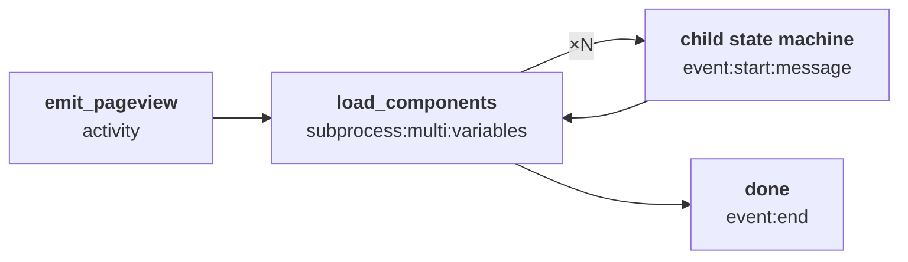

# subprocess:multi:variables

A FOR-EACH loop that runs a child config once per item in `items`. The child state machine runs inline in the same worker thread — no new threads, no separate clock. Any records emitted by the child share the parent's simulated time and output stream.

The BPMN term for this construct is **Multi-Instance Sub-Process (Sequential)**.

**Execution order:**

1. For each item in `items`, evaluate that item's variable specs and write the results into the shared namespace.
2. Run the child state machine from its `event:start:message` entry point to `event:end`.
3. After all iterations complete, transition to `next` in the parent.

The child runs in the same variable namespace as the parent — variables set in parent activity states are automatically visible to the child without being listed in `items`.

| Field | Description | Required? |
| --- | --- | --- |
| `name` | Unique name for this state. | Yes |
| `type` | Must be `"subprocess:multi:variables"`. | Yes |
| `items` | A non-empty list of iterations. Each item is a list of variable specs — the same format as a `variables` block in an `activity` state. The list length determines how many times the child runs. | Yes |
| `states` | Path to the child config file (relative to the working directory). | Yes |
| `next` | Name of the next state after all iterations complete. | Yes |



```json
{
  "name": "load_components",
  "type": "subprocess:multi:variables",
  "items": [
    [{"name": "url", "type": "string:static", "value": "/index.html"}, {"name": "bytes", "type": "int:static", "value": 1247}],
    [{"name": "url", "type": "string:static", "value": "/static/style.css"}, {"name": "bytes", "type": "int:static", "value": 8432}],
    [{"name": "url", "type": "string:static", "value": "/static/app.js"}, {"name": "bytes", "type": "int:static", "value": 42180}]
  ],
  "states": "presets/configs/child.json",
  "next": "done"
}
```

---

## The `items` list

Each entry in `items` is a list of variable specs — exactly the same format as a `variables` block in an `activity` state. Any generator type valid in a `variables` block is valid here: `string:static`, `int:static`, `enum`, `ipaddress`, and so on.

The engine parses all items at startup (via the same path as activity `variables`) and evaluates each one at runtime before starting that iteration's child run. The results are written into the shared namespace before the child's `event:start:message` state runs.

Put only the **per-iteration deltas** in `items` — values that change between iterations. Session-level values already in the namespace from parent activity states are automatically available to the child without being re-listed.

---

## Child config

The file named in `states` must declare [`event:start:message`](./event-start-message.md) as its entry point. The engine raises an error if no `event:start:message` state is found.

A child config designed only for subprocess use contains no `event:start:timer` — it will fail standalone validation, which is correct and expected. A config that must work both standalone and as a subprocess declares both entry points.

### Emitter inheritance

The child config inherits all emitters defined in the parent. Child-defined emitters override parent emitters with the same name. A subprocess-only child typically declares no `emitters` block at all.

To emit a value written by the parent's `items`, use `"type": "variable"` in an emitter dimension:

```json
{"name": "url", "type": "variable", "variable": "url"}
```

See [emitters](../emitters.md) for the full dimension reference.

---

## See also

- [State types index](../states.md)
- [event:start:message](./event-start-message.md) — required child entry point
- [Generated variables](../variables-generated.md) — variable types valid in `items` entries
- [Emitters](../emitters.md) — emitter structure and dimension fields
